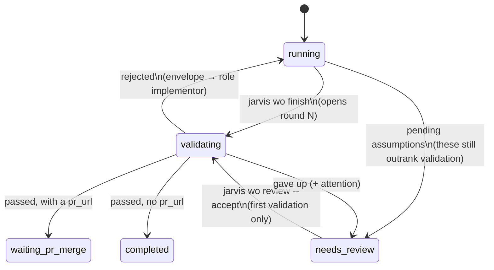
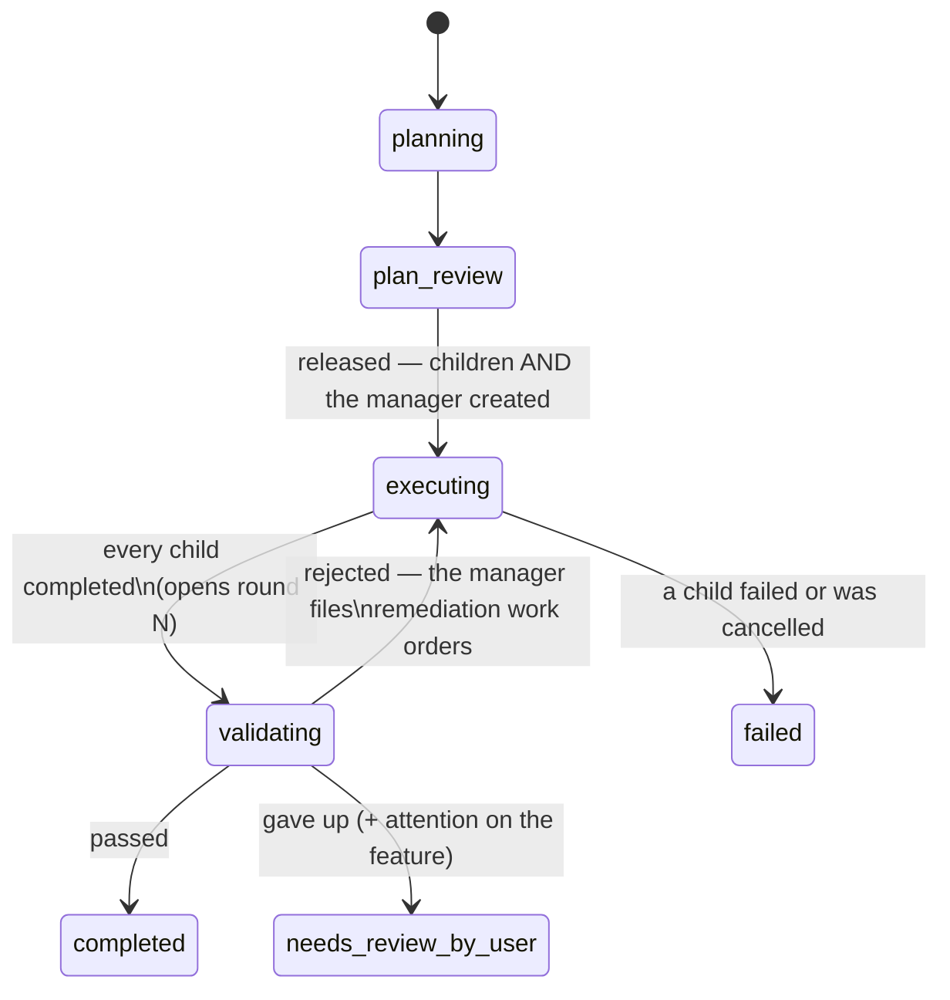

# The validation panel — no work unit is done until an independent reviewer says so

*2026-08-08*

Feature order `fo-e353491c`. Planned by `wo-cd73c537`.

---

## Problem

A Jarvis work order settles itself. The worker runs `jarvis wo finish --pr <url>`, and
`ops.finish` writes `result_summary`, sets `waiting_pr_merge`, and the work order lands on
the user's merge queue. A feature order settles itself too: `Daemon.settle_features` marks
it `completed` the moment its last child completes. Nothing between a unit's own claim and
the user's inbox asks whether the work is actually finished.

That places the entire quality bar on two things: the worker's self-assessment, which is
the least independent opinion available, and the user's review, which is the attention this
OS exists to conserve. The failure it produces is recognisable — work arrives at the merge
queue with no tests, or with tests that do not exercise the change, or with a claim of
evidence the diff does not support, and the user is the first reader who notices.

**The ask.** Each working unit — **work order or feature order** — should not be claimed
done, or ready for PR review, until an *external* validator has said so: a panel of
profiled reviewers (tester, security, architect, maintainer) that reads the code changes
and the testing evidence and may reject with concrete asks. The implementor uses the
feedback and resubmits. Each round carries a fingerprint so that new evidence is provably
new. After enough rounds the loop gives up and escalates to a human. And **neither side
knows the other exists**.

---

## The three principles

Everything below follows from three rules. They are stated first because every design
decision in this document is an application of one of them.

### 1. Nobody addresses anybody directly

A work order does not talk to the project manager. The validation panel does not talk to
the work order. **Every cross-entity message is an envelope posted to a ROLE and delivered
by a router.** The sender names a role and a subject; it never names a work order id, and
it never learns who read it.

This is the user's explicit architectural constraint, and its purpose is extension: a new
participant is a new role plus a routing rule, not an edit to everything that might want to
talk to it.

### 2. The router, not the sender, decides what happens when a role is unfilled

A deferral posted by a work order with no parent feature has no project manager to reach —
and that is the overwhelmingly common case today. The sender does not branch on that. The
router files the backlog item itself, which is exactly today's behaviour. **A sender that
has to ask "does the recipient exist?" is a sender that is coupled to the recipient.**

### 3. Every judging entity sees input and produces output, and knows nothing else

The panel receives a packet and returns an outcome. The implementor receives review
feedback and produces a resubmission. The project manager receives envelopes and acts. None
of them is aware of the machinery around it, so any of them can be replaced without
touching the others.

---

## What this proposes, in one picture

```
   ┌──────────────────┐                            ┌──────────────────────┐
   │  THE IMPLEMENTOR │                            │  THE PROJECT MANAGER │
   │                  │                            │                      │
   │ a worker session │                            │ a session that owns  │
   │ on its worktree  │                            │ one feature order's  │
   │                  │                            │ follow-through       │
   └───┬───────────▲──┘                            └──┬────────────────▲──┘
       │           │                                  │                │
  finish        role:                            finish             role:
  --evidence    implementor                      --evidence         manager
       │           │                                  │                │
       ▼           │                                  ▼                │
  ╔════════════════╧══════════════════════════════════════════════════╧═════╗
  ║                          THE MESSAGE BUS                                ║
  ║   envelopes addressed to a ROLE, delivered by a pure router.            ║
  ║   Nothing below this line knows who is above it.                        ║
  ╚═══════════════════════════╦═════════════════════════════════════════════╝
                              │
              ┌───────────────┴────────────────┐
              │      THE ROUND MACHINE         │
              │  collects evidence, fingerprints│
              │  it, opens a round, counts them,│
              │  decides when to give up        │
              └───────────────┬────────────────┘
                    packet    │    outcome
                              ▼
              ┌────────────────────────────────┐
              │      THE VALIDATION PANEL      │
              │  tester  security  architect   │
              │        maintainer              │
              │            │                   │
              │       arbitrate()  ← veto table│
              │            │                   │
              │          chair                 │
              └────────────────────────────────┘
```

The implementor and the project manager are **the same shape**: a session that submits
evidence and receives review feedback. That is what lets one round machine and one panel
serve both, and it is the whole reason the feature-order case became tractable.

---

## Scope: both units, and what makes that possible

This design was originally written for work orders only, and deferred the feature-order
case on the grounds that **a feature order has no session, so a rejection has no
addressee**. The user overruled that and supplied the missing entity: the **project manager
order**.

That resolves the objection completely, and it is worth recording why, because the two
follow-on objections dissolve with it:

| the original objection | why it no longer holds |
|---|---|
| No addressee for a rejection | The project manager order **is** the addressee. It is a session, it can be sent a message, and it can act — by filing remediation work orders under the feature. |
| The fingerprint is meaningless with no rounds | There are rounds now: the manager receives feedback, remediation lands, and the feature re-validates. The fingerprint does exactly the job it does for a work order — it proves the second submission is not the first one reworded. |
| The evidence is already validated child by child | Still true, and it is now a *feature*, not a problem. Each child passed on its own diff; what the feature-level panel adds is the **integration** question — two children individually correct and jointly wrong. That is the defect nothing else in the OS can see. |

---

## The message bus

### The envelope

```
envelopes
─────────
id            INTEGER PK
ts            REAL
project       TEXT
subject_wo_id TEXT   ──▶ work_orders(id)      the unit this is ABOUT
subject_fo_id TEXT   ──▶ feature_orders(id)   (exactly one of the two)
from_role     TEXT   reviewer | implementor | manager
to_role       TEXT   implementor | manager
kind          TEXT   review_feedback | deferral_request
payload       TEXT   JSON
state         TEXT   queued | delivered | handled_by_router | undeliverable
delivered_wo_id TEXT the row it actually reached — written by the ROUTER, never
                     by the sender, and the only record of who read it
```

### The router

```python
# src/jarvis/bus.py — imports project_store and central_store, nothing above them
def resolve(store, envelope) -> str | None:
    """Which work order fills `to_role` for this envelope's subject? None if nobody."""

def post(store, *, subject, from_role, to_role, kind, payload) -> int:
    """Queue an envelope. Returns its id. NEVER resolves — resolution is delivery's job."""

def deliver(store, central, envelope) -> str:
    """Route one envelope. Returns the new state."""
```

Resolution rules, and they are the entire routing table:

| `to_role` | resolves to |
|---|---|
| `implementor` | the subject work order itself |
| `manager` | the `kind='manager'` work order whose `parent_id` is the subject's feature order |

**Delivery rides the existing queue.** Once resolved, `deliver` calls
`store.queue_message(wo_id, text, source=...)`, and `Daemon.deliver_messages` turns it into
the next turn on that session exactly as it does for `jarvis wo send`. No new dispatch path,
no second scheduler — the same discipline feature orders followed when they reused
`claim_next_pending` rather than inventing a queue.

**When a role is unfilled**, the router decides — principle 2:

| case | what the router does |
|---|---|
| `deferral_request`, no manager (a work order with no parent feature) | files the backlog item itself; state `handled_by_router`. This is today's behaviour, preserved exactly. |
| `review_feedback`, no implementor (the work order was cancelled or deleted) | state `undeliverable`, and the round escalates. Feedback that reached nobody must never look like feedback that was acted on. |
| the manager is cancelled but the feature is live | state `undeliverable` + attention on the feature order. A feature whose manager is gone cannot run its loop, and the user has to know. |

**Ordering and duplicates.** Envelopes are delivered oldest-first per subject, and `state`
moves to `delivered` in the same transaction as the `queue_message` insert — so a daemon
that dies between the two redelivers nothing, and a daemon that dies before either
redelivers the whole envelope. At-least-once with a transactional hand-off, which is what
the message queue already guarantees for `wo send`.

---

## The project manager order

A third `WO_KINDS` value. `WO_KINDS = ("worker", "planner", "manager")`.

```
  jarvis fo plan <fo-id> --from-file plan.json
                │
                ▼
       Neo (or the user) releases the plan
                │
                ▼
   ProjectStore.create_plan_children — ONE transaction
                │
        ┌───────┴────────┬─────────────────┐
        ▼                ▼                 ▼
   child wo #1  …   child wo #N      THE MANAGER ORDER
   kind=worker      kind=worker      kind=manager
   parent_id=fo     parent_id=fo     parent_id=fo
```

It is created **in the same transaction** as the children, because a feature holding
children but no manager is a feature whose deferrals and rejections have nowhere to go —
the same all-or-nothing argument that transaction already makes about the children
themselves.

### Why a new kind costs almost nothing — and the one place it does

This is the most important implementation fact in the whole document, and it was
established by reading every kind-filtered query in the codebase.

**Every kind filter in Jarvis is POSITIVE.** `kind='worker'`, never `kind != 'planner'`.
Four sites: `project_store.py:531`, `:535`, `:563` and `:734`. Because they name the kind
they want rather than the kind they exclude, a third kind is **automatically** excluded from
all of them:

| query | consequence for the manager |
|---|---|
| `feature_children` (`:734`) | the manager is not a child of the feature for settlement purposes — so it **cannot deadlock feature completion** by staying open, and cancelling it **cannot mark the feature `failed`** |
| `claim_next_pending`'s `max_parallel` clause (`:563`) | the manager is exempt from its own feature's slot cap, exactly as the planner is |
| the attention rollup (`:531`, `:535`) | the manager does not distort the "N of M children need you" line |

**The one exception, and it is a fleet-wide deadlock if missed.** `count_active`
(`project_store.py:546`) has **no kind filter at all** — it counts every work order in
`ACTIVE_STATUSES`, and `waiting_input` is one of them. A manager is *designed* to sit idle in
`waiting_input` for the entire life of its feature. So:

```
   max_concurrent: 2
   two feature orders in flight
   → two managers parked in waiting_input
   → count_active() == 2
   → dispatch_pending never claims another work order. The project stops.
```

`count_active` must exclude `kind='manager'`. A coordinator is not a piece of the work —
the same reasoning that already exempts the planner from `max_parallel`, applied to the
project-wide cap.

### The other three things a long-lived idle session breaks

| where | what happens without a change |
|---|---|
| `Daemon.settle_work_order` | its default for a done turn with no `result_summary` is `needs_review` + attention "worker idle without `jarvis wo finish`". A manager is idle **by design**; without a `kind='manager'` branch sending it to `waiting_input` with no attention, every feature order carries a permanent false flag. |
| `dispatch.build_worker_prompt` (`dispatch.py:230`) | the branch is `if kind == "planner": … else: <worker contract>`. A manager falls through to the worker contract and is told to open a pull request. It needs a third branch. |
| `Daemon.settle_features` | the manager must be completed when the feature settles, or it lingers as an open work order against a closed feature. |

### What the manager is told

Its contract is short and it is not a worker's:

- You own one feature order's follow-through. You will not write product code.
- You will receive messages. Act on each one and end your turn.
- **Review feedback on the feature**: decide what has to change, file work orders under
  this feature to change it, then resubmit the feature's evidence.
- **A deferral request**: file the backlog item, recording which work order suggested it
  and which feature it came from.
- You do not know who sends you these. Do not try to find out.

---

## The two validation loops

### Work orders



### Feature orders



The two diagrams are deliberately the same shape. One round machine drives both; the only
differences are what the evidence packet contains and which role the rejection is addressed
to.

### Three properties that are load-bearing

**`validating` raises no attention**, in either machine. It is the system working. Only the
give-up transition flags anyone.

**A work order in `validating` spends a concurrency slot** (`ACTIVE_STATUSES`) because it
holds a live session the OS intends to resume. A *manager* does not, per the section above.
Those two facts look contradictory and are not: the work order will be resumed within
minutes and the manager may idle for days.

**Feature validation happens after the children have merged**, so its diff is real merged
code on the default branch. Work-order validation happens after the PR is opened and before
the merge queue, so nothing unvalidated ever reaches the user.

---

## The evidence packet

One dataclass, two collectors, distinguished by a `unit` field.

| field | `unit="work_order"` | `unit="feature"` |
|---|---|---|
| `title`, `description` | the work order's brief | the feature order's original ask |
| `summary` | the worker's `--summary` | the manager's `--summary` |
| `declared` | the worker's `--evidence` | the manager's `--evidence` |
| `base` … `head` | merge base … worktree HEAD | the feature's `base_sha` … the default branch now |
| `files`, `diff` | the worktree diff | the integrated diff of everything the children merged |
| `children` | *(absent)* | each child's title, `result_summary` and declared evidence |

**The feature's `base_sha` is recorded when the feature enters `executing`** — the default
branch's head at the moment its first child could start. Everything between that and the
default branch now IS the feature, by construction, and it needs no per-child bookkeeping.

The work-order merge-base ladder is pinned, because "which branch is the default" has no
obvious answer and would otherwise be guessed per project:

```
1. git symbolic-ref --quiet refs/remotes/origin/HEAD   → strip "refs/remotes/"
2. else origin/main   (if git rev-parse --verify succeeds)
3. else main          (if it verifies)
4. else base = ""  and  diff = git diff HEAD

With a base:  diff = git diff <base>...HEAD   PLUS   git diff HEAD
              ─────────────────────────────         ───────────────
              committed work                        anything uncommitted
```

Both halves. A worker that forgot to commit has still produced the change.

**Truncation cuts at a file boundary, never mid-hunk**, and `dropped_files` records what it
removed. **`files` is never truncated at any limit** — it is what lets a seat say *"you
claim tests were added, and no file under `tests/` appears in this diff"* even when the diff
itself was cut short.

---

## The fingerprint

```
fingerprint = sha256( full diff content BEFORE truncation
                    + whitespace-normalised `declared` text )[:16]
```

**And nothing else.** Not `head`, not `base`, not `summary`, not `pr_url`.

| a submitter that… | changes | new evidence? |
|---|---|---|
| adds an empty commit | `head` | **no** — the fingerprint must not move |
| rewords its summary | `summary` | **no** |
| re-runs the same tests, says so more confidently | `declared` whitespace | **no** |
| adds a test file | the diff | **yes** |
| states a result it had not stated before | `declared` content | **yes** |

Hashing `packet.diff` is the obvious implementation and it is wrong: the same tree would
fingerprint differently at two truncation limits, making an integrity check depend on a
display setting.

**A repeat escalates immediately and consumes no round**, compared against the
**immediately preceding** round only. A submitter that legitimately reverts to an earlier
shape because the panel told it to is not cheating.

---

## The panel

| seat | asks | veto |
|---|---|---|
| `tester` | is the change actually exercised? is the declared evidence supported by the diff? is a class of testing missing? | **yes** |
| `security` | what can this change expose, leak, or let through? | **yes** |
| `architect` | does this fit the layering, or cut across it? | no |
| `maintainer` | will the next person be able to change this? | no |
| `chair` | turns four opinions into one outcome and the prose the submitter reads | — |

### The veto table is a pure function, not a clause in the chair's prompt

```
arbitrate(opinions) -> a forced rejection, or None ("let the chair decide")

    security raises `blocking`  ──▶ REJECTED
    tester   raises `blocking`  ──▶ REJECTED
    architect,  however it replies  ──▶ nothing
    maintainer, however it replies  ──▶ nothing

    NOTHING FORCES A PASS.
    Structurally: exactly one non-None return, and its outcome is "rejected".
```

Pure — plain dicts in, a dict or None out. The input shape is deliberately a stored
`validation_opinions` row, so arbitration can be replayed over the record.

**`architect` and `maintainer` hold no veto** because their failure mode is an annoying
rejection loop, which spends exactly the time this feature exists to save. Same reasoning as
Neo's `taste` seat, and it is the negative control of the whole table: a panel where every
seat can block is a panel with no evidence the arbitration does anything.

**`blocking` is read permissively** (`bool(value)`, not `is True`), so a model writing the
string `"false"` blocks something it did not mean to. That is the only direction this can be
wrong in.

**The seats judge the packet and only the packet** — `cwd = $JARVIS_HOME`, no tools. A
headless call carries no settings file, so a tooled seat's reach would depend on the user's
global configuration rather than on anything Jarvis controls.

---

## The deferral path

The second duty the user specified, and a clean demonstration of principles 1 and 2.

```
  a child work order, having agreed a deferral with Neo:

      jarvis wo defer <wo-id> "title" --why "…" [--neo-question <id>]
                          │
                          │  posts an envelope. Names a ROLE, not a manager.
                          ▼
      ╔═══════════════════════════════════════════════════╗
      ║  kind=deferral_request      to_role=manager        ║
      ╚═══════════════════════╤═══════════════════════════╝
                              │
                  ┌───────────┴────────────┐
        a manager exists            no manager
        (the wo has a parent        (an ordinary standalone
         feature order)              work order)
                  │                         │
                  ▼                         ▼
     delivered to the manager      THE ROUTER files the
     as a message; it files        backlog item itself.
     the backlog item.             Today's behaviour, exactly.
                  │                         │
                  └───────────┬─────────────┘
                              ▼
              backlog row, carrying the relationship:
                  origin_wo_id  — who suggested it
                  origin_fo_id  — which plan it came out of
                  origin_note   — the why, and the Neo question id
```

The `backlog` table today has **no relationship columns at all** (`id, project, title,
description, status, depends_on, promoted_wo_id, created_at`), so capturing "the dependency
and relationship with the plan and the work order from where it was suggested" means three
additive columns.

Note what the calling work order does **not** do: it does not check whether it has a parent
feature, it does not look up a manager, and it does not call `jarvis backlog add`. It posts
and forgets. That is principle 2 doing its job — and it is why the same command works
unchanged for a standalone work order today and for a feature child tomorrow.

---

## Where it plugs into the existing code

```
  ┌──────────────────────────────────────────────────────────────────┐
  │ daemon.py    the ONLY module that knows about all of them        │
  │   _validator(cfg) → validation.decide or None                    │
  │   settle_work_order: early-return on `validating`                │
  │   settle_features:   route to `validating`, settle the manager   │
  │   deliver_envelopes: the bus's tick                              │
  └───┬──────────────┬───────────────┬───────────────┬───────────────┘
      │              │               │               │
  ┌───▼────┐  ┌──────▼──────┐  ┌─────▼──────┐  ┌─────▼────────┐
  │ ops.py │  │  bus.py NEW │  │validation. │  │ project_store│
  │ finish │  │  post()     │  │   py  NEW  │  │  rounds      │
  │ review │  │  resolve()  │  │  decide()  │  │  opinions    │
  │ defer  │  │  deliver()  │  │  arbitrate │  │  envelopes   │
  └───┬────┘  └─────────────┘  └──┬─────┬───┘  └──────────────┘
      │                           │     │
  ┌───▼─────────────┐    ┌────────▼──┐  │ extracted from, and reused by
  │ evidence.py NEW │    │seats.py NEW│ │  ┌──────────────────┐
  │  collect_*()    │    │  Roster    │ └─▶│ panel.py         │
  │  fingerprint()  │    │  run_blind │    │ (Neo — behaviour │
  │  stdlib only    │    └────────────┘    │  unchanged)      │
  └─────────────────┘                      └──────────────────┘
```

`validation.py` must never import `neo`, `neo_store` or `panel`; `panel.py` must never
import `validation`; **and neither may import `bus`** — the round machine posts, the panel
only returns a value. The daemon is the only place any two of them are known together.

### Every touch point, and the trap it carries

| where | change | the trap |
|---|---|---|
| `count_active` (`project_store.py:546`) | exclude `kind='manager'` | **no kind filter today**; an idle manager in `waiting_input` permanently eats a project concurrency slot, and two features stop the project |
| `dispatch.py:230` | a third `kind` branch | the branch is `if planner … else worker`, so a manager silently gets the worker contract |
| `Daemon.settle_work_order` | a `kind='manager'` idle branch | its default flags an idle session `needs_review`; a manager is idle by design |
| `Daemon.settle_features` | route to `validating`; settle the manager | it looks only at `executing` features — that is what makes "flag once" true **by construction**, and routing must not break it |
| `ops.finish` | opens a round, sets `validating` | closes the backlog item only on `completed`; a new intermediate status silently stops backlog items closing |
| `ops.review_work_order` | the **second** route into done | a work order that filed assumptions goes finish → `needs_review` → review, bypassing `finish` entirely and reaching the merge queue unvalidated |
| `Daemon.settle_work_order` | early return on `validating` | it re-derives status from the latest turn on **every** tick, so without the return it sets `waiting_pr_merge` on the next one |
| `create_plan_children` | create the manager too | all-or-nothing: a feature with children and no manager has nowhere to route |
| `invariants.status_label` | a `validating` branch | it early-returns for every status that is not `pending`; a later branch is dead code |
| `invariants.true_blockers` | branches for escalated rounds | `INV-ATTENTION-REASON` rewrites any attention reason this cannot re-derive |
| `timeline.event_level` | new kinds | it returns `"signal"` for unknown kinds, so the obvious test is vacuous |
| `ui.STATUS_META` | a `validating` entry | templates index it by status; a missing key 500s the project page |
| `bootstrap.TEMPLATE_VERSION` | bumped | without it the new contract prose never reaches an already-bootstrapped project |
| `assets/validator-seats/` | **not** `assets/agents/` | `bootstrap._rebuild` copytrees `agents/` into every planner's `.claude/agents/`, so a seat dropped there becomes a bogus subagent |
| `panel.definition`'s `lru_cache` | key on the roster | `chair.md` will exist in two seat directories; a name-only key means the first one loaded poisons the other |

---

## Data model

```
validation_rounds                          validation_opinions
─────────────────                          ───────────────────
id                                         id
wo_id  ──▶ work_orders(id)     CASCADE     round_id ──▶ validation_rounds(id) CASCADE
fo_id  ──▶ feature_orders(id)  CASCADE     ts
CHECK ((wo_id IS NULL) <> (fo_id IS NULL)) seat
round        1-based, per subject          reply     the seat's raw reply, verbatim
ts                                         verdict   pass | reject | ''
fingerprint                                status    ok | abstained | failed
summary / evidence / pr_url                model / latency_ms
outcome  pending | passed | rejected        UNIQUE (round_id, seat)
         | escalated | failed
reason   what was sent back

CREATE UNIQUE INDEX … ON validation_rounds(wo_id, round) WHERE wo_id IS NOT NULL;
CREATE UNIQUE INDEX … ON validation_rounds(fo_id, round) WHERE fo_id IS NOT NULL;
```

**One polymorphic table, not two.** Both loops record identical facts, and two tables would
mean two of every reader, two renderers and two chances to disagree about what a round is.
The two nullable foreign keys keep real `ON DELETE CASCADE` for both parents, which a single
`subject_id` column could not.

**PARTIAL unique indexes, not a three-column `UNIQUE`.** SQLite treats NULLs as distinct in
a `UNIQUE` constraint, so `UNIQUE (wo_id, fo_id, round)` would enforce nothing at all on
either loop — it would look correct and silently permit duplicate rounds.

**`UNIQUE (round_id, seat)`**, not `(subject, seat)`. The nearest precedent,
`neo_store.panel_opinions`, keys on the question because a Neo question has exactly one
round. A validation has up to three, and the wrong constraint would silently drop round
two's opinions.

Additive elsewhere: `work_orders.kind` gains `manager`; `feature_orders` gains `base_sha`;
`backlog` gains `origin_wo_id`, `origin_fo_id`, `origin_note`.

---

## Configuration

`os.validation` in the catalog. **The feature ships disabled**, and at that default the OS
is byte-identical to today: same statuses, same events, same number of `claude` calls, zero
rows in any new table, and no manager order created.

| key | default | notes |
|---|---|---|
| `enabled` | **`false`** | enabling it is a separate decision, after measurement |
| `roster` | tester, security, architect, maintainer, chair | a name outside the vocabulary is a `CatalogError` |
| `seat_models` / `chair_model` | `{}` / `""` | the chair writes what a human reads |
| `timeout` | `300` | per seat, seconds |
| `max_rounds` | `3` | per unit, then escalate |
| `diff_chars` | `60000` | truncation limit |
| `feature_units` | `true` | whether feature orders validate too, independently of work orders |

**Why disabled by default, when the ask is phrased as a mandatory gate.** A round is
roughly five headless `claude` calls over a diff of up to 60 000 characters, up to three
rounds, on *every* unit in the fleet — the highest-volume path there is — and it throttles
dispatch. The precedent is Neo's panel, which shipped disabled behind an eval; the volume
here makes measuring first more important, not less.

---

## Failure modes

| situation | what happens | why |
|---|---|---|
| **empty diff** (`files == ()`) | escalate at once, **never call the panel** | a panel handed an empty diff will pass it, and that single silent failure would make the feature theatre |
| **fingerprint repeats** the previous round | escalate at once, consume no round | the submitter has stopped producing evidence |
| **`max_rounds` rejections** | escalate | the give-up the ask calls for |
| **panel unreachable** (`ClaudeCliError`) | round `failed`, retry next tick, **consume no round** | a transport outage is not a verdict |
| …3 outages in a row | escalate | not retrying for ever |
| **a seat abstains** | contributes no signal; the panel proceeds | silence is neither veto nor consent |
| **daemon restarts mid-validation** | `INV-VALIDATION-STRANDED` finds a `pending` round older than `2 × timeout`; `--repair` closes it `failed` | otherwise the unit sits in `validating` for ever with no flag |
| **an envelope reaches nobody** | `undeliverable`, and the round escalates | feedback that reached nobody must never look like feedback that was acted on |
| **the manager is cancelled, feature live** | `undeliverable` + attention on the feature | the loop cannot run and the user must know |
| **feature rejected → remediation → rejected → …** | bounded by `max_rounds`, same counter | the loop that could run for ever is the one worth bounding twice |
| **the user merges a work order's PR mid-validation** | not handled in v1 | on a pass the poller closes it within ~2 min; on a rejection the worker is told to fix merged code. Known, accepted, backlogged |
| **the user wants out** | `jarvis wo done` / `jarvis fo cancel` | they already mean "the user says this is finished" |

**Escalation goes straight to the user, not to Neo.** The ask allows "Neo or even a human".
A Neo hop needs a fourth question kind, a persona, a verdict shape and a daemon branch — and
Neo has strictly less information than the panel that just failed to settle it. Backlogged.

---

## Deliberately not built

| | why |
|---|---|
| a Neo triage hop before escalation | strictly less information than the panel that failed |
| enabling it by default | a catalog edit, after the eval measures cost and quality |
| roles beyond `implementor` and `manager` | the bus makes adding one cheap; adding one before anything needs it is speculative |
| per-project roster overrides | a second config merge path that buys nothing until someone has run it |
| reusing Neo's learnings ledger for validator seats | it would make a per-project validator depend on the OS-wide Neo database |
| gating `pr_merge` on a validation pass | couples two review systems that escalate to different people |
| running a validator as a subagent inside the worker's session | destroys the independence that is the entire point |
| a production-corpus replay in the eval | this repository is public and the corpus would need the user to label it |

---

## The decomposition

Eleven work orders. Arrows are dependency edges.

```
   bus ──────────┬──────────────▶ loop ──┬──▶ entrypoints
                 │           ▲           │
   schema ───────┼───────────┤           ├──▶ panel ──┬──▶ eval
                 │           │           │            │
   evidence ─────┘───────────┘           └──▶ surfaces│
                 │                                    │
                 └──▶ manager ──┬──▶ deferral         │
                                │                     │
                                └──▶ feature-validation┘
```

| # | child | delivers |
|---|---|---|
| 1 | `bus` | envelopes, roles, the pure router, delivery, the unfilled-role rule |
| 2 | `schema` | both `validating` statuses, `kind='manager'`, the polymorphic round tables, config, labels |
| 3 | `evidence` | the packet and the fingerprint (`unit="work_order"`) |
| 4 | `loop` | the work-order round machine; the validator is an **injected callable defaulting to `None`** |
| 5 | `entrypoints` | the `review_work_order` route, the worker contract, `INV-VALIDATION-STRANDED` |
| 6 | `panel` | `seats.py` extracted, `validation.py`, the five seats, the daemon wiring |
| 7 | `manager` | the project manager order: creation, contract, idle settlement, **the `count_active` exemption** |
| 8 | `deferral` | `jarvis wo defer`, the envelope kind, the backlog relationship columns, the no-manager fallback |
| 9 | `feature-validation` | `FO_STATUSES` `validating`, `base_sha`, `collect_feature`, the feature round machine |
| 10 | `surfaces` | rounds, envelopes and the manager in the CLI and the dashboard |
| 11 | `eval` | a graded LLM eval of both panels, plus the free harness that keeps it honest |

**Why eleven and not eight.** This is now three things: a messaging substrate, a new
long-lived entity, and two validation loops that share one panel. The child cap exists to
bound the blast radius of a plan nobody reads closely — the honest response to exceeding it
is to say so and let the user decide, not to make five children into three big ones.

**`loop` must not be split further.** `finish → validating`, the off-thread runner and the
reconciler early return each leave a state where a finished work order is lost if shipped
without the others. Everything that can safely land after that seam is in `entrypoints`.

---

## What this design does not know yet

1. **Do the seats reject the right things?** Only a graded eval can say. The design commits
   to the *structure* — nothing forces a pass, two seats hold vetoes — and leaves the
   judgement quality to measurement.
2. **How often does a submitter actually pass `--evidence`?** The flag is optional, because
   requiring it would break every worker in flight.
3. **Is the integrated feature diff a reviewable object?** A feature of six children may be
   a very large diff. Truncation makes it safe but perhaps not useful, and the feature-level
   panel may need a different roster or a summarising pass. The eval is where that shows up.
4. **What does a round cost?** Unmeasured. The eval prints the number and asserts nothing
   about it: there is no baseline, and a test that failed on cost would spend real money to
   be flaky.
