# The validation panel — no work unit is done until an independent reviewer says so

*2026-08-08*

Feature order `fo-e353491c`. Planned by `wo-cd73c537`.

---

## Problem

A Jarvis work order settles itself. The worker runs `jarvis wo finish --pr <url>`, and
`ops.finish` writes `result_summary`, sets `waiting_pr_merge`, and the work order lands
on the user's merge queue. Nothing between the worker's own judgement and the user's
inbox asks whether the work is actually finished.

That places the entire quality bar on two things: the worker's self-assessment, which is
the least independent opinion available, and the user's review of the pull request, which
is the attention this OS exists to conserve. The failure it produces is specific and
recognisable — work arrives at the merge queue with no tests, or with tests that do not
exercise the change, or with a claim of evidence that the diff does not support, and the
user is the first reader who notices.

**The ask.** Each working unit should not be claimed done, or ready for PR review, until
an *external* validator has said so: a panel of profiled reviewers (tester, security,
architect, maintainer) that reads the code changes and the testing evidence and may reject
with concrete asks — more tests, a refactor, a class of testing that is missing. The
implementor uses the feedback and resubmits. Each round carries a fingerprint so that new
evidence is provably new. After enough rounds the loop gives up and escalates to a human.
And **neither side knows the other exists**: the implementor receives review feedback, the
panel receives a submission.

---

## What this proposes, in one picture

```
                    ┌──────────────────────────────────────────────┐
                    │              THE IMPLEMENTOR                 │
                    │   an ordinary worker session on its own      │
                    │   worktree. Knows nothing about a panel.     │
                    └───────────────┬──────────────────────────────┘
                                    │  jarvis wo finish --pr … --evidence …
                                    ▼
                    ┌──────────────────────────────────────────────┐
                    │            THE ROUND MACHINE                 │
                    │  collects the evidence packet, fingerprints  │
                    │  it, opens a round, calls the validator,     │
                    │  counts rounds, decides when to give up      │
                    └───┬──────────────────────────────────┬───────┘
              packet    │                                  │  reason (prose)
                        ▼                                  │
        ┌───────────────────────────────────┐              │
        │        THE VALIDATION PANEL       │              │
        │                                   │              │
        │  tester  security  architect      │              │
        │        maintainer                 │              │
        │            │                      │              │
        │       arbitrate()   ← veto table  │              │
        │            │                      │              │
        │          chair                    │              │
        │  Knows nothing about a worker.    │              │
        └───────────────────────────────────┘              │
                        │                                  │
                        └──── outcome + reason ────────────┘
                                    │
                 ┌──────────────────┼──────────────────┐
                 ▼                  ▼                  ▼
            passed            rejected            escalated
       waiting_pr_merge    review feedback     needs_review
        or completed       back to the         + attention:
                           implementor         a human decides
```

The two boxes that do the judging never address each other. The round machine is the only
thing that has both halves, and it speaks to each in that side's own vocabulary: a packet
to the panel, review feedback to the implementor.

---

## Scope: work orders only

The ask names "each working unit (work order **or feature order**)". **This design covers
work orders. Feature-order validation is deliberately deferred** to backlog item
`bl-4d0eba66`, and here is why, so that it is a choice rather than an omission.

| | why it does not transfer |
|---|---|
| **No addressee for a rejection** | The whole loop is *reject → deliver as a message → the implementor adjusts → resubmit*. That needs a live conversation. A feature order never runs a session — `FO_STATUSES` was deliberately not made a copy of `WO_STATUSES` for exactly this reason. The only possible addressees are a newly filed child work order (which makes the validator a planner — a different feature) or the user (which is not a loop, it is an attention flag, and `Daemon.settle_features` already raises those). |
| **The evidence is already validated** | A feature order's diff is the union of its children's merged PRs, and under this design every one of those children passed the panel before it could reach the merge queue. The only marginal defect left is an *integration* defect — two children each correct and jointly wrong. Worth catching, but it needs a different evidence packet (the default branch as it now stands, against the original ask), a different roster (nobody checks test coverage on an already-merged diff) and a different remedy (a follow-up work order). |
| **The fingerprint has no meaning** | It exists to prove round N's evidence differs from round N−1's. With no resubmission there are no rounds. |

**What is deferred is not "the panel for feature orders".** The coherent minimal version,
recorded on `bl-4d0eba66`, is one question asked when `Daemon.settle_features` is about to
mark a feature order `completed` — *does the union of these children deliver the original
ask?* — and on "no", a flag with the reason. One model call, one attention flag, no new
status, no loop.

**Consequence to be explicit about:** until that is built, a feature order still completes
the moment its last child completes, and every one of those children will have been
validated individually. `FO_STATUSES` and `Daemon.settle_features` are untouched by this
design, and they are correct by construction, because `validating` is neither `completed`
nor `failed`.

---

## The work-order lifecycle

The new status is `validating`. It sits between the worker's claim and the user's merge
queue, and it is the only state this design adds.

```mermaid
stateDiagram-v2
    [*] --> pending
    pending --> dispatching
    dispatching --> running
    running --> validating: jarvis wo finish\n(opens round N)
    running --> needs_review: pending assumptions\n(these still outrank validation)
    needs_review --> validating: jarvis wo review --accept\n(first validation only)

    validating --> waiting_pr_merge: passed, with a pr_url
    validating --> completed: passed, no pr_url
    validating --> running: rejected\n(feedback queued as a message)
    validating --> needs_review: gave up\n(+ attention)

    waiting_pr_merge --> completed: the user merges;\nthe PR poller closes it
    needs_review --> completed: the user decides
    validating --> completed: jarvis wo done\n(the user's escape hatch)
```



Three properties of that diagram are load-bearing.

**`validating` raises no attention.** It is the system working, exactly like
`waiting_pr_merge`. Only the give-up transition raises a flag. A status that put every
finished work order into the "NEEDS YOU" strip would destroy the strip.

**`validating` spends a concurrency slot** — it goes into `ACTIVE_STATUSES` as well as
`OPEN_STATUSES`. A work order under validation holds a live Claude session the OS intends
to resume. Without the slot, a project capped at `max_concurrent: 2` can pile six work
orders into validation and then start five concurrent worker turns the moment three of
them are rejected on the same tick. The accepted cost: a slow validation queue throttles
dispatch.

**Validation happens after the PR is opened and before the merge queue.** The sequence is
*worker opens its PR → `jarvis wo finish --pr` → `validating` → passed →
`waiting_pr_merge`*. The ask says "not ready for PR review until a validator said so", and
this ordering delivers exactly that: the PR never reaches the user's queue unvalidated.
It also absorbs a rejection for free — the worker pushes more commits to the same open PR,
with no new branch and no new PR. Validating *before* the PR exists has no event in the
worker contract to hang on.

---

## One round, end to end

```mermaid
sequenceDiagram
    participant W as Implementor<br/>(worker session)
    participant O as ops.finish
    participant D as Daemon<br/>(main tick thread)
    participant P as validation.decide<br/>(pool thread)
    participant S as Seats

    W->>O: jarvis wo finish --pr … --evidence "…"
    O->>O: evidence.collect() → packet
    O->>O: evidence.fingerprint(packet)
    O->>O: open_validation_round(…) status → validating
    Note over O: returns immediately.<br/>The worker's turn is over.

    D->>D: tick: sees validating + a pending round
    Note over D: settle_work_order returns early —<br/>it must not re-derive this status
    D->>P: submit to the validate pool<br/>(its own ProjectStore)
    P->>S: one blind round: tester, security,<br/>architect, maintainer (concurrent)
    S-->>P: four opinions, recorded as rows
    P->>P: arbitrate(opinions) → forced rejection or None
    alt arbitration forced nothing
        P->>S: chair synthesises
        S-->>P: {outcome, reason}
    end
    P-->>D: {outcome, reason, seats}

    alt passed
        D->>D: close round, → waiting_pr_merge / completed
    else rejected
        D->>W: queue_message(source="review")<br/>REVIEW FEEDBACK (round n of 3)
        Note over W: next turn goes out; the worker<br/>sees ordinary review feedback
    else escalated
        D->>D: needs_review + attention
    end
```

The panel runs **off the tick thread**. Four seats at a 300-second timeout run inline
would freeze every project in the catalog. It uses the pattern the Neo tick already uses:
a single-worker `ThreadPoolExecutor`, a re-entrancy guard so a second tick cannot start a
second validation, and the pool thread opening its **own** `ProjectStore` — sqlite
connections belong to the thread that opened them, and `db.connect` does not pass
`check_same_thread=False`, so getting this wrong raises rather than corrupting.

The round row is opened on the **main** thread, before the fan-out. That is what makes a
crash mid-validation recoverable: it leaves a `pending` round that `INV-VALIDATION-STRANDED`
can find.

---

## The evidence packet

What a seat sees, and the *only* thing it sees. Assembled from the work order's git
worktree by a new stdlib-only leaf module, `src/jarvis/evidence.py`.

| field | what it carries |
|---|---|
| `title`, `description` | the work order's brief, verbatim — a validator that does not know what was asked cannot judge scope |
| `summary` | the worker's `--summary` for this round |
| `declared` | the worker's `--evidence` text, verbatim: what it ran and what it showed |
| `base`, `head` | resolved merge base and worktree HEAD |
| `stat` | `git diff --stat` |
| `files` | every changed path — **never truncated** |
| `diff` | the unified diff, truncated to `diff_chars` |
| `diff_truncated`, `dropped_files` | whether truncation happened and what it removed |

**The merge-base ladder is pinned**, because "which branch is the default" has no obvious
answer and would otherwise be guessed differently per project:

```
1. git symbolic-ref --quiet refs/remotes/origin/HEAD   → strip "refs/remotes/"
2. else origin/main   (if git rev-parse --verify succeeds)
3. else main          (if it verifies)
4. else base = ""  and  diff = git diff HEAD

With a base:  diff = git diff <base>...HEAD   PLUS   git diff HEAD
              ─────────────────────────────         ───────────────
              committed work                        anything uncommitted
```

Both halves, concatenated. A worker that forgot to commit has still produced the change,
and the validator must see it.

**Truncation cuts at a file boundary, never mid-hunk**, and the dropped file names are
carried in `dropped_files` so a seat can say what it did not see. A silently truncated
diff read as complete is how a security seat passes the file it never opened.

**`files` is never truncated**, at any limit. It is what lets a seat say *"you claim tests
were added, and no file under `tests/` appears in this diff"* even when the diff itself was
cut short.

---

## The fingerprint

The integrity check of the whole loop. It answers one question: **is round N's evidence
actually different from round N−1's?**

```
fingerprint = sha256( full diff content BEFORE truncation
                    + whitespace-normalised `declared` text )[:16]
```

**And nothing else.** Not `head`, not `base`, not `summary`, not `pr_url`. The reasoning
is the point of the design:

| a worker that… | changes | is it new evidence? |
|---|---|---|
| adds an empty commit | `head` | **no** — and the fingerprint must not move |
| rewords its summary | `summary` | **no** |
| re-runs the same tests and says so more confidently | `declared` whitespace only | **no** |
| adds a test file | the diff | **yes** |
| states a test result it had not stated before | `declared` content | **yes** |

Hashing `packet.diff` instead of the pre-truncation content is the obvious implementation
and it is wrong: the same worktree would then fingerprint differently at two truncation
limits, which makes the check depend on a display setting.

**A repeat escalates immediately and consumes no round**, and it is compared against the
**immediately preceding** round only — never against every prior round. A worker that
legitimately reverts to an earlier shape because the panel told it to is not cheating.

---

## The panel

Five seats, shipping as markdown in `src/jarvis/assets/validator-seats/`. A seat is data:
a file plus a name in the catalog roster.

| seat | asks | veto |
|---|---|---|
| `tester` | is the change actually exercised? is the declared evidence supported by the diff? is a class of testing missing (unit, browser, eval)? | **yes** |
| `security` | what can this change expose, leak, or let through? | **yes** |
| `architect` | does this fit the layering and the interfaces, or does it cut across them? | no |
| `maintainer` | will the next person be able to change this? | no |
| `chair` | turns four opinions into one outcome and the prose the implementor reads | — |

### The veto table is a pure function, not a clause in the chair's prompt

```
arbitrate(opinions) -> a forced rejection, or None ("let the chair decide")

    security raises `blocking`  ──▶ REJECTED
    tester   raises `blocking`  ──▶ REJECTED
    architect,  however it replies  ──▶ nothing
    maintainer, however it replies  ──▶ nothing

    NOTHING FORCES A PASS.
    Structurally: exactly one non-None return, and its outcome is "rejected".
```

Pure — plain dicts in, a dict or None out. No store, no model, no clock. The shape of the
input is deliberately the shape of a stored `validation_opinions` row, so the arbitration
can be replayed over what was recorded as well as over what was just collected.

**Why `architect` and `maintainer` hold no veto.** Their failure mode is an annoying
rejection loop, and that spends exactly the implementor time this feature exists to save.
This is the same reasoning that gives Neo's `taste` seat no veto, and it is the negative
control of the whole table: a panel in which every seat can block is a panel with no
evidence that the arbitration does anything.

**`blocking` is read permissively** — `bool(value)`, not `is True` — so a model that writes
the string `"false"` blocks something it did not mean to. That is the only direction this
can be wrong in: a permissive read costs one rejection too many, a strict read costs one
too few, and only one of those lets bad work through.

### The seats judge the packet and only the packet

They run with `cwd = $JARVIS_HOME` and **no tools**. They cannot go and read the
repository. This is a deliberate v1 call rather than an oversight: a headless call carries
no settings file, so what a tooled seat could actually reach would depend on the user's
global configuration rather than on anything Jarvis controls. The cost is that a seat
cannot verify a claim beyond the diff; the mitigation is `files`, `stat` and
`dropped_files`. It is worth revisiting once the eval has measured it.

### Neither side knows the other exists

This is a structural rule, not a stylistic one.

```
  what the panel produces          what the implementor receives
  ───────────────────────          ─────────────────────────────
  four seat opinions          ──▶  REVIEW FEEDBACK (round 2 of 3)
  each with a verdict,             <the chair's reason>
  a reason and asks                
                                   Address this and then run
  stored in                        `jarvis wo finish … --evidence "…"`
  validation_opinions              again. Re-submitting without changed
  ↑                                code or new evidence will end the review.
  inspectable on demand,
  never pushed anywhere            No seat name. No "panel". No "validator".
```

The message is one module-level constant that nothing else may reformat, and the test that
pins it asserts the constant contains no seat name *and*, in the same test, that the
`validation_opinions` rows for that round do — because "this must not appear" is satisfied
perfectly by a system where the deliberation never happened.

The same separation runs through the surfaces: rounds (number, outcome, reason) are shown
by default; per-seat replies are on demand only, and never in the timeline.

---

## Where it plugs into the existing code

```
  ┌──────────────────────────────────────────────────────────────────┐
  │ daemon.py     the ONLY module that knows about both halves       │
  │               _validator(cfg) → validation.decide or None        │
  │               settle_work_order: early-return on `validating`    │
  └────────────┬─────────────────────────────────────┬───────────────┘
               │                                     │
  ┌────────────▼──────────────┐        ┌─────────────▼────────────────┐
  │ ops.py                    │        │ validation.py       NEW      │
  │  finish(evidence=…)       │        │  decide()                    │
  │  review_work_order()      │        │  arbitrate()  ← pure         │
  └────────────┬──────────────┘        └──────┬───────────────┬───────┘
               │                              │               │
  ┌────────────▼──────────────┐   ┌───────────▼──────┐  ┌─────▼────────┐
  │ evidence.py         NEW   │   │ seats.py    NEW  │  │ project_store│
  │  collect(), fingerprint() │   │  Roster          │  │  rounds +    │
  │  stdlib only              │   │  run_blind()     │  │  opinions    │
  └───────────────────────────┘   └────────┬─────────┘  └──────────────┘
                                           │  extracted from, and reused by
                                  ┌────────▼─────────┐
                                  │ panel.py         │  Neo's panel —
                                  │ (behaviour       │  behaviour must not
                                  │  unchanged)      │  change by one byte
                                  └──────────────────┘
```

**`validation.py` must never import `neo`, `neo_store` or `panel`**, and `panel.py` must
never import `validation`. The same seam that keeps `neo` from importing `panel`: the
daemon is the only place both are known, and each side is testable without the other.

**`seats.py` is an extraction, not a copy.** `panel.py` already contains a blind-round
primitive whose subtle parts — building every prompt on the calling thread before the
fan-out, and distinguishing *a seat that never replied* from *a seat that replied with
something unusable* — are exactly what a second copy loses. Extracting it parameterises
the asset directory, the seat vocabulary and the prompt header, and leaves Neo's observable
behaviour byte-identical.

> **Trap this creates.** `chair.md` will exist in *both* `assets/neo-seats/` and
> `assets/validator-seats/`, and `panel.definition` is `@lru_cache`-keyed on the seat name
> alone. Keyed that way after the extraction, the first `chair` loaded poisons the other
> for the life of the process. The cache key must include the roster.

### Every touch point, and what it must not break

| where | change | the trap |
|---|---|---|
| `ops.finish` | opens round 1, sets `validating` | closes the backlog item only on `completed` — a new intermediate status silently stops backlog items closing |
| `ops.review_work_order` | the **second** route into done | a work order that filed assumptions goes finish → `needs_review` → review, bypassing `finish` entirely, and reaches the merge queue unvalidated |
| `Daemon.settle_work_order` | early return on `validating` | it re-derives status from the latest turn on **every** tick, so without the return it sets `waiting_pr_merge` on the very next one |
| `Daemon.poll_pull_requests` | untouched | it looks only at `waiting_pr_merge`, so a validating work order's PR is not polled — correct, and it must not lose the url |
| `invariants.status_label` | a `validating` branch | it early-returns for every status that is not `pending`; a branch added after that line is dead code |
| `invariants.true_blockers` | a branch for an escalated round | `INV-ATTENTION-REASON` rewrites any attention reason this cannot re-derive |
| `timeline.event_level` | four new kinds | it returns `"signal"` for kinds it does not know, so the obvious test is vacuous |
| `ui.STATUS_META` | a `validating` entry | templates index it by status; a missing key 500s the whole project page |
| `bootstrap.TEMPLATE_VERSION` | bumped | without the bump the new contract prose never reaches an already-bootstrapped project |
| `assets/validator-seats/` | **not** `assets/agents/` | `bootstrap._rebuild` copytrees `agents/` wholesale into every planner's `.claude/agents/`, so a seat dropped there becomes a bogus subagent |

---

## Data model

Two tables, in the per-project database next to `work_orders`.

```
validation_rounds                        validation_opinions
─────────────────                        ───────────────────
id                                       id
wo_id      ──▶ work_orders(id) CASCADE   round_id ──▶ validation_rounds(id) CASCADE
round      1-based, per work order       ts
ts                                       seat
fingerprint                              reply      the seat's raw reply, verbatim
summary    the worker's --summary        verdict    pass | reject | ''
evidence   the worker's --evidence       status     ok | abstained | failed
pr_url                                   model
outcome    pending | passed | rejected    latency_ms
           | escalated | failed
reason     what was sent back            UNIQUE (round_id, seat)
UNIQUE (wo_id, round)
```

`UNIQUE (round_id, seat)` — **not** `(wo_id, seat)`. The nearest precedent,
`neo_store.panel_opinions`, keys on the question because a Neo question has exactly one
round of deliberation. A validation has up to three, and the wrong constraint would
silently drop round two's opinions.

---

## Configuration

`os.validation` in the catalog. **The feature ships disabled**, and at that default the OS
is byte-identical to today: same statuses, same events, same number of `claude` calls,
zero rows in either table.

| key | default | notes |
|---|---|---|
| `enabled` | **`false`** | enabling it is a separate decision, after measurement |
| `roster` | tester, security, architect, maintainer, chair | a name outside the vocabulary is a `CatalogError`; a name whose markdown ships in a later release parses and fails at run time |
| `seat_models` | `{}` | per-seat model override |
| `chair_model` | `""` | the chair writes what a human reads; it can keep the expensive model when the seats do not |
| `timeout` | `300` | per seat, seconds |
| `max_rounds` | `3` | then escalate |
| `diff_chars` | `60000` | truncation limit |

**Why disabled by default, when the ask is phrased as a mandatory gate.** A validation
round is roughly five headless `claude` calls over a diff of up to 60 000 characters, up to
three rounds, on *every* work order in the fleet — the highest-volume path there is — and
it also throttles dispatch. That is a large, unmeasured multiplier on the OS's token bill.
The precedent is Neo's panel, which shipped disabled and behind an eval; the volume here
makes measuring before enabling more important, not less. Turning it on is a catalog edit,
recorded as backlog item for after the eval reports.

---

## Failure modes, and what each one does

Every row here is a decision, not a default.

| situation | what happens | why |
|---|---|---|
| **empty diff** (`files == ()`) | escalate at once, **never call the panel** | a panel handed an empty diff will pass it, and that single silent failure would make the whole feature theatre |
| **fingerprint repeats** the previous round | escalate at once, consume no round | the implementor has stopped producing evidence; more rounds will not help |
| **`max_rounds` rejections** | escalate | the give-up the ask calls for |
| **the panel is unreachable** (`ClaudeCliError`) | mark the round `failed`, retry next tick, **consume no round** | a transport outage is not a verdict, and must not spend the implementor's budget |
| …3 outages in a row | escalate | not retrying for ever |
| **a seat times out or abstains** | it contributes no signal; the panel proceeds | silence is neither a veto nor consent — the chair's mandate says so in as many words |
| **the daemon restarts mid-validation** | `INV-VALIDATION-STRANDED` finds a `pending` round older than `2 × timeout`; `--repair` closes it `failed` and it retries | otherwise the work order sits in `validating` for ever with no attention flag, which is the invisibly-stalled failure `invariants.py` exists to prevent |
| **the user merges the PR mid-validation** | not handled in v1 | on a pass it lands in `waiting_pr_merge` and the poller closes it within ~2 minutes; on a rejection the worker is told to fix already-merged code. A known, accepted limitation with a backlog item, rather than a half-solution |
| **the user wants out** | `jarvis wo done` | it already means "the user says this is finished". Two overrides would be one too many |

**Escalation goes straight to the user, not to Neo.** The ask allows "Neo or even a human".
A Neo hop would need a fourth question kind, a persona, a verdict shape and a daemon
branch — a work order on its own — and Neo has strictly less information than the panel
that just failed to settle it. Backlogged rather than dismissed.

---

## Deliberately not built

| | why |
|---|---|
| feature-order validation | a different feature — see **Scope** above; `bl-4d0eba66` |
| a Neo triage hop before escalation | strictly less information than the panel that failed |
| enabling it by default | a catalog edit, after the eval measures cost and quality |
| per-project roster overrides | a second config merge path that buys nothing until someone has run it |
| reusing Neo's learnings ledger for validator seats | it would make a per-project validator depend on the OS-wide Neo database, and hand the user a second teaching surface with no CLI and no retraction semantics |
| gating `pr_merge` on a validation pass | couples two review systems that escalate to different people; the ordering already ensures nothing unvalidated reaches the queue |
| running the validator as a subagent inside the worker's session | destroys the independence that is the entire point |
| a production-corpus replay in the eval | this repository is public and the corpus would need the user to label it |

---

## The decomposition

Seven work orders. Arrows are dependency edges — a child does not start until everything
it needs has completed and merged.

```
   ┌──────────┐                         ┌──────────────┐
   │  schema  │──┐                   ┌─▶│ entrypoints  │  second route into done,
   │          │  │   ┌──────────┐    │  └──────────────┘  worker contract, stranded
   │ status   │  ├──▶│   loop   │────┤                    invariant
   │ tables   │  │   │          │    │  ┌──────────────┐     ┌────────┐
   │ config   │  │   │ finish → │    ├─▶│    panel     │────▶│  eval  │
   │ labels   │  │   │validating│    │  │              │     │        │
   └──────────┘  │   │ runner   │    │  │ seats.py     │     │ LLM    │
                 │   │ early    │    │  │ validation.py│     │ grade  │
   ┌──────────┐  │   │ return   │    │  │ 5 seat .md   │     │ + cost │
   │ evidence │──┘   │ rounds   │    │  └──────────────┘     └────────┘
   │          │      └──────────┘    │
   │ packet   │                      │  ┌──────────────┐
   │fingerprint│                     └─▶│   surfaces   │  CLI + dashboard
   └──────────┘                         └──────────────┘
```

| # | child | what it delivers |
|---|---|---|
| 1 | `schema` | the `validating` status, both tables, `ValidationConfig`, the attention constant and the labels. Produces no round. |
| 2 | `evidence` | `evidence.py` — the packet and the fingerprint. A leaf with no callers yet. |
| 3 | `loop` | the round machine: `finish` opens a round, the off-thread runner, the reconciler early return, all round accounting. The validator is an **injected callable defaulting to `None`**, so this is fully testable before the panel exists. |
| 4 | `entrypoints` | the `review_work_order` route, the worker-contract prose plus the template-version bump, `INV-VALIDATION-STRANDED`. |
| 5 | `panel` | `seats.py` extracted, `validation.py`, the five seat definitions, the daemon wiring. |
| 6 | `surfaces` | rounds in `jarvis wo show` and the dashboard; deliberation on demand only. |
| 7 | `eval` | a synthetic LLM eval grading what the panel rejects and passes, plus the free harness test that keeps it honest, plus the cost reading. |

**`schema` and `evidence` run in parallel**, and so do `entrypoints`, `panel` and
`surfaces`. `loop` deliberately lands **before** `panel`: the round machine is testable
against a fake validator, so making it wait on the real one would be a false dependency
edge costing wall-clock for nothing.

**`loop` is one work order and must not be split further.** `finish → validating`, the
runner, and the reconciler early return each leave a state where a finished work order is
lost if shipped without the others. Everything that *can* safely land after that seam
exists is in `entrypoints` instead.

---

## What this design does not know yet

Honest open questions, for the eval to answer rather than the design to assert.

1. **Do the seats reject the right things?** Only a graded eval can say. The design
   commits to the *structure* — nothing forces a pass, two seats hold vetoes — and leaves
   the judgement quality to measurement.
2. **How often does a worker actually pass `--evidence`?** The flag is optional, because
   requiring it would break every worker in flight. If compliance is low, the tester seat
   rejects most first rounds and the cost floor doubles.
3. **Should the seats see the work order's description?** They do, so they can judge
   scope. But a reviewer that has read the reasoning can rationalise it — the same
   structural-blindness argument the plan reviewer makes about Neo.
4. **What does a round actually cost?** Unmeasured. The eval prints the number and asserts
   nothing about it: there is no baseline, and a test that failed on cost would spend real
   money to be flaky.
