# The plan, in diagrams

*Feature order `fo-e353491c` — "no work unit is done until an independent validator says so"*

This is the **plan**: what gets built, in what order, by how many work orders, and how the
pieces fit. Every section is a picture with one line of caption.

- The reasoning behind each decision lives in the design document:
  [`2026-08-08-validation-panel-design.md`](./2026-08-08-validation-panel-design.md)
- Absolute path on this machine:
  `/home/gonzalo/workspace/agentic_os/docs/superpowers/specs/2026-08-08-validation-panel-plan.md`

---

## 1. What is being built

Two submitters, one bus, one round machine, one panel. Nothing on the left knows anything
on the right exists.

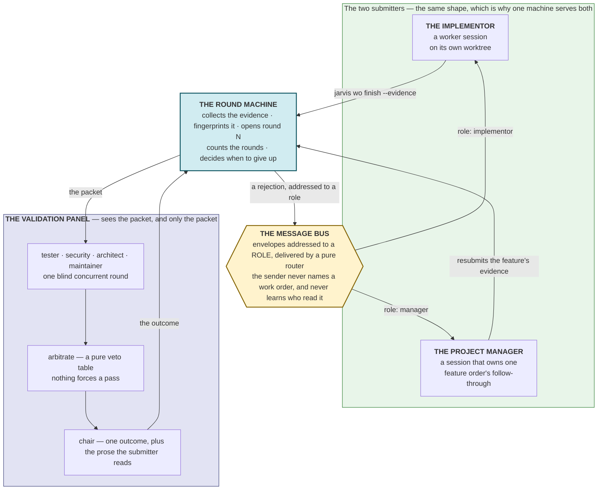

---

## 2. The plan itself — 11 work orders, 5 waves

Boxes are work orders. Arrows are dependency edges (`--depends-on`). A wave is everything
that can run at the same time.

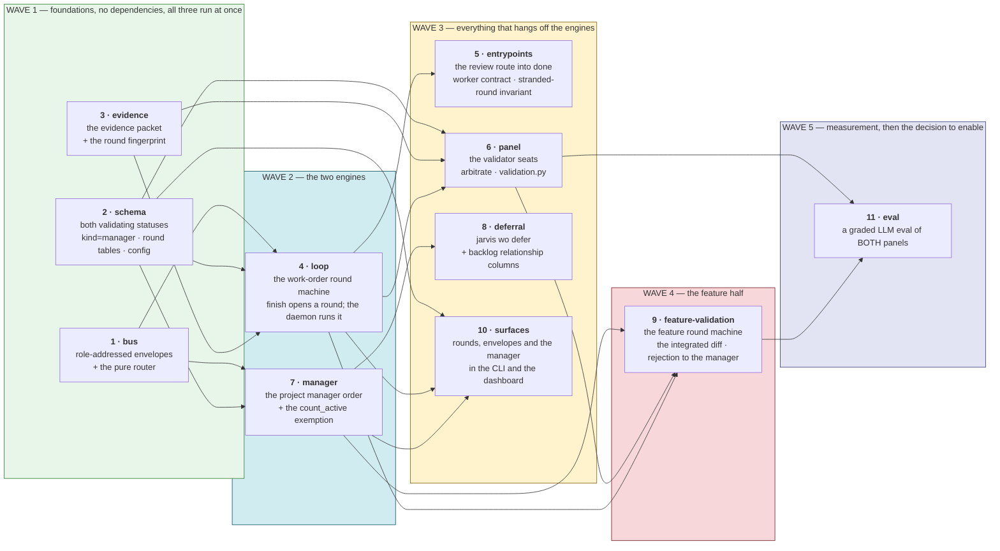

**The whole feature ships disabled.** `os.validation.enabled = false` until child 11 has
measured what a round costs and whether the seats reject the right things. Every child brief
carries the same sentence: *with `os.validation.enabled` false, this path must not run and
the OS behaves exactly as it does today.*

---

## 3. The 11 work orders

| # | key | title | depends on |
|---|---|---|---|
| 1 | `bus` | Build the message bus: role-addressed envelopes and a pure router | — |
| 2 | `schema` | Add both `validating` statuses, the `manager` work-order kind and the polymorphic validation tables | — |
| 3 | `evidence` | Build the evidence packet and the round fingerprint | — |
| 4 | `loop` | Build the work-order round machine: `finish` opens a round, the daemon runs the validator off-thread, the reconciler stands back | bus, schema, evidence |
| 5 | `entrypoints` | Close the assumption-review route into done, tell workers about `--evidence`, and catch a stranded round | loop |
| 6 | `panel` | Ship the validator seats, the arbitration table and the validation panel | schema, evidence, loop |
| 7 | `manager` | Create the project manager order and fix everything a long-lived idle work order breaks | bus, schema |
| 8 | `deferral` | Add `jarvis wo defer`: route deferred work to the project manager, or to the backlog when there is none | manager |
| 9 | `feature-validation` | Validate feature orders: the integrated diff, the feature round machine, and rejections routed to the manager | manager, panel, loop |
| 10 | `surfaces` | Render validation rounds, envelopes and the manager order in the CLI and the dashboard | schema, loop, manager |
| 11 | `eval` | Grade both validation panels with a synthetic LLM eval and prove the eval is wired | panel, feature-validation |

---

## 4. What happens to a work order

`validating` is the one new state. It raises **no attention** — it is the system working.

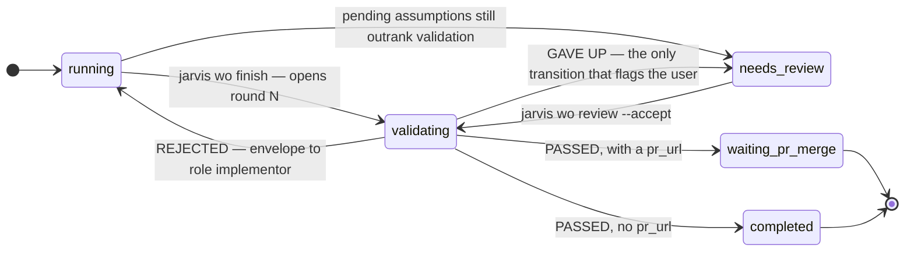

## 5. What happens to a feature order

Deliberately the same shape. One round machine drives both.

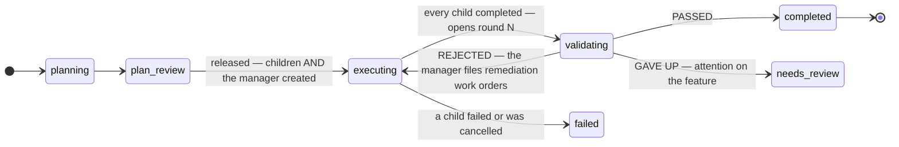

---

## 6. One validation round, end to end

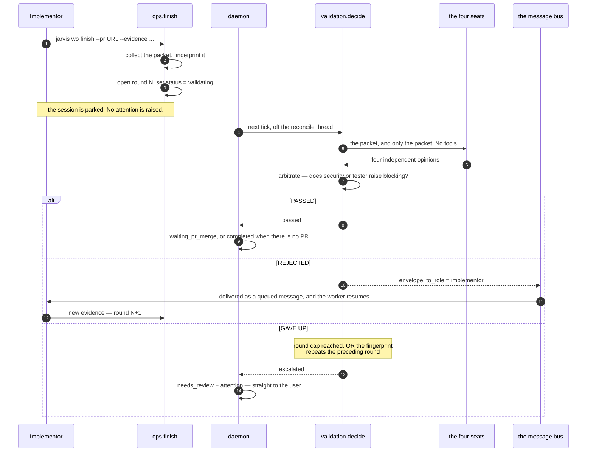

**The fingerprint** is what stops a resubmission that changes nothing. It is computed over
the declared evidence and the tree, not over the truncated diff text — hashing the displayed
diff would make an integrity check depend on a display setting. A repeat escalates
immediately and **consumes no round**.

## 7. One feature round, end to end

The only difference: the packet is an integrated diff of merged code, and the rejection is
addressed to `role: manager` instead of `role: implementor`.

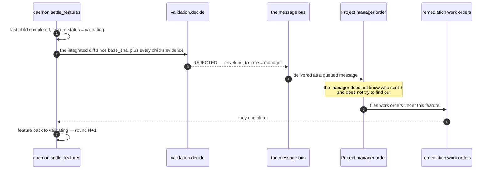

---

## 8. Where deferred work goes

The clean demonstration of the decoupling rule: **the router, not the sender, decides what
happens when a role is unfilled.**

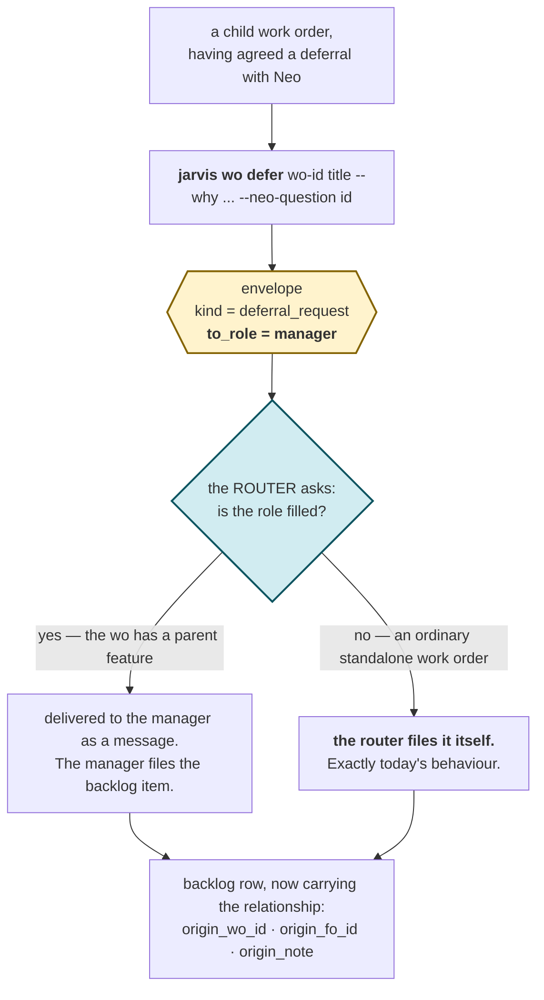

What the calling work order does **not** do: check whether it has a parent feature, look up
a manager, or call `jarvis backlog add`. It posts and forgets. That is why the same command
works unchanged for a standalone work order today and a feature child tomorrow.

---

## 9. Who can block, and who cannot

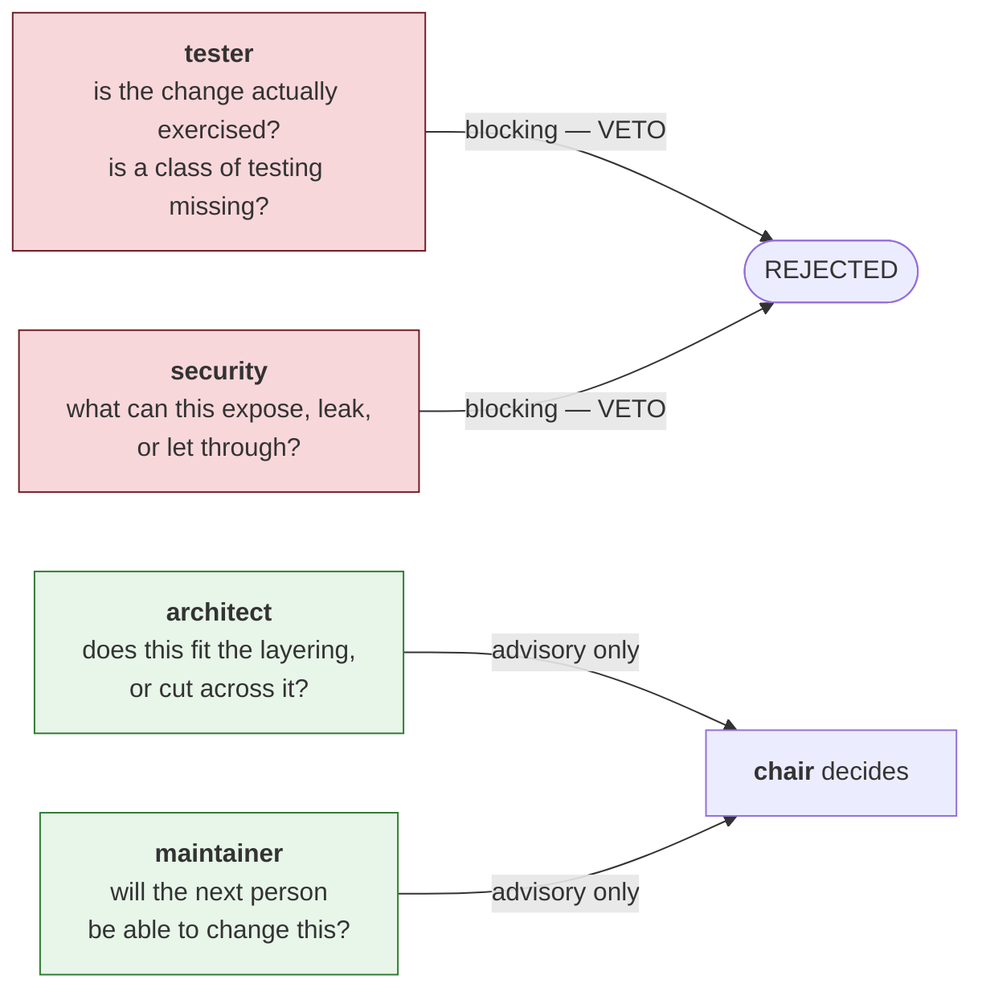

`architect` and `maintainer` hold no veto because their failure mode is an annoying
rejection loop, which spends exactly the time this feature exists to save. **Nothing forces
a pass** — `arbitrate` has exactly one non-`None` return, and its outcome is `rejected`.

---

## 10. Where it lands in the existing code

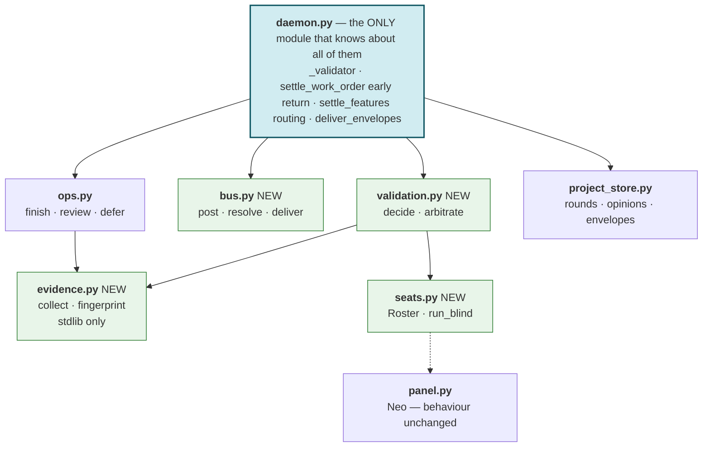

`validation.py` must never import `neo`, `neo_store` or `panel`; `panel.py` must never
import `validation`; and **neither may import `bus`**. The daemon is the only place any two
of them are known together — that is the decoupling, expressed as an import rule a test can
check.

---

## 11. The one thing that stops the fleet if it is missed

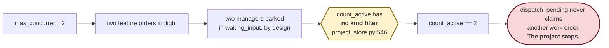

Child 7 (`manager`) carries the fix: `count_active` must exclude `kind='manager'`. Every
*other* kind filter in Jarvis is positive (`kind='worker'`, never `kind != …`), so a third
kind is automatically excluded from all of them — this is the single exception, and it is a
project-wide deadlock.

---

## 12. Why eleven and not eight

The cap is eight. This plan asks for eleven, and says so rather than hiding it in three
oversized children.

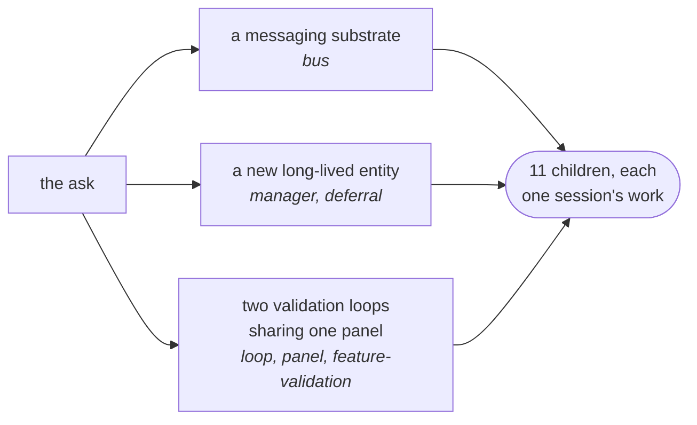

The child cap exists to bound the blast radius of a plan nobody reads closely. The honest
response to exceeding it is to say so and let the user decide — not to fold five children
into three big ones. **`loop` in particular must not be split further**: `finish →
validating`, the off-thread runner and the reconciler early return each leave a state where
a finished work order is *lost* if shipped alone. Everything that can safely land after that
seam is already split out into `entrypoints`.

---

## 13. What this plan does not know yet

| open question | where it gets answered |
|---|---|
| Do the seats reject the right things? | child 11, the graded eval |
| What does a round cost? | child 11 prints it and asserts nothing — there is no baseline |
| Is a whole feature's diff a reviewable object? | child 11; may need a different roster or a summarising pass |
| How often will a worker actually pass `--evidence`? | measured after enabling; the flag is optional so nothing in flight breaks |

Enabling the feature is a **separate decision, after the eval** — one catalog edit.
