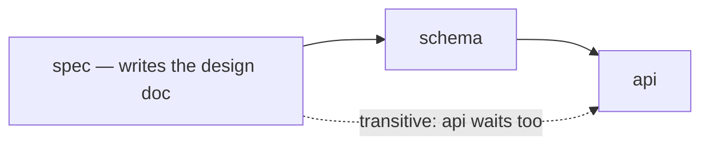

# The work order record — say it once

*2026-08-23*

Work order `wo-ed9af5b7`. Design decision on scope: Neo, question 140.

---

## Problem

The user opened `wo-9652be2f` and listed six things wrong with the page. Five of them are
the same fault wearing different clothes: **text the reader is already looking at, written
again a few inches away.**

- The description was six kilobytes restating the design document that ships beside it.
- The first timeline entry restated that description.
- Every `Assumption recorded` entry restated the assumption listed a screen above it.
- Every `Worker asked a question` entry printed the question directly above its answer.
- Every Neo answer took two lines — a bookkeeping event saying an answer arrived, then
  the answer — and the surviving line credited it to the user.

The sixth was the shape of the page itself: three full-height blocks stacked, so reading
the last meant scrolling past the other two every time.

Duplication of this kind has no failing test and no bug report, because it **costs**
attention rather than losing information. Nothing is missing; there is simply more to read
than there is to know. The existing rule in this area (`kn-fa9311fc`) guards the opposite
failure — a renderer reading a payload key nobody writes, which renders blank for ever —
and every test written to that rule passes on a page that says everything twice.

---

## 1. The rule

> **A record says what happened. Where the thing that happened has a record of its own,
> it POINTS at that record rather than reproducing it.**

Two corollaries, and the second is the one that gets forgotten:

1. A pointer is only a saving if it resolves. Replacing text with a number or an id
   obliges whatever resolves it to stay reachable for the whole life of the record.
2. A rule about brevity that lives in prose is not a rule. Where the OS already
   instructs and is already ignored, the check moves into Python — the same argument
   `plans.py` makes about all its other validations.

---

## 2. Briefs cite the design document; they do not carry it

> **CORRECTION, 2026-08-29 (wo-4580e7c1).** §2's argument stands and its numbers do not.
> `MAX_DESCRIPTION_CHARS` is **600**, not 1500; a brief now carries only what its section
> of the spec does not say. §2.1's two-field table is gone — **`design_doc` is required
> and `design_doc_by` was removed** (Neo, question 179), so §2.2 and `_transitive_needs`
> describe machinery that no longer exists. Read
> `2026-08-29-spec-driven-feature-orders.md` instead. §2.3's scope ruling is unchanged.

`dispatch._planner_prompt` has told planners *"a description is a BRIEF, not an
encyclopedia"* for as long as the `design_doc` field has existed, and the OS materialises
that document into every child's worktree. Planners still shipped six-kilobyte briefs
walking through it section by section. Prose in a prompt is not a constraint.

**`plans.MAX_DESCRIPTION_CHARS = 1500`** is the ceiling, the mirror of the existing
`MIN_DESCRIPTION_CHARS` floor. The two are not opposites: a brief must stand alone as
*instructions*, which is not a licence to restate the design.

### 2.1 The ceiling's price: the document has to exist

A brief may only cite what a worker can open, so a plan must now say where the document is.
It names exactly one of:

| field | means | who checks |
|---|---|---|
| `design_doc` | the spec is written and in the planner's tree | `ops.submit_plan` snapshots it and refuses a dangling path |
| `design_doc_by` | there is no spec yet, and **this child writes one** | `plans._spec_problems` |

Naming **both** is refused rather than merged: `ops.submit_plan` demands that a named
`design_doc` already exist on disk, so a plan claiming both a written document and a child
that writes it describes two different worlds.

### 2.2 The ordering check is what makes `design_doc_by` real

A spec-writing child its siblings do not wait for is a spec written in parallel with the
work it governs — the citations in those briefs would point at a file that is not there
yet. So **every other child must reach the spec-writing child through the dependency
graph**, directly or transitively (`plans._transitive_needs`).



`_transitive_needs` tolerates a cycle rather than recursing for ever: cycles are reported
by their own check, and this one must still return an answer for the same submission so
the planner gets every problem at once.

### 2.3 Scope

**Planner-generated plans only** (Neo, q140). `CLAUDE.md` directive 3 tells Jarvis to pack
the user's full intent into a work order description, and that stands: a user's own words
are the one description that must not be compressed.

---

## 3. The timeline points

`build_timeline` entries carry a `ref` key — present on every entry, set on almost none, so
a template never has to ask whether the key exists.

```python
{"kind": "neo_question", "id": 7, "label": "question #7"}
```

It is deliberately **surface-neutral** — never a URL — because the same entry is rendered by
the dashboard, which has a page for it (`/neo/question/<id>`), and by `jarvis wo show`,
which has the CLI's own question command.

| entry | was | is |
|---|---|---|
| `created` | title + description | nothing; both are at the top of every surface that renders this timeline |
| `assumption` | the assumption's text | `Assumption #2 recorded` — see §4 |
| `question_asked` | the whole question | a `ref` to the question, which holds the answer too |

`question_asked` falls back to the text when the event carries no question id: an entry
that says neither what was asked nor where to read it says nothing at all.

---

## 4. Numbering, and the list that has to resolve it

An assumption's number is its **position among its own work order's assumptions**, from 1,
in the order recorded. Not a row id — those are global to the project and would start a
work order's list at 47.

It is computed on read rather than stored, so it is right for rows written before it
existed. `add_assumption` writes the same number into the event payload by the same rule
(count in `ts` order), and `build_timeline` re-derives it positionally for older rows, so
the two can never disagree.

**The resolvability trap.** Both surfaces originally listed only the *pending* assumptions,
so the moment #2 was reviewed, `Assumption #2 recorded` pointed at nothing — corollary 1 of
§1, violated by the very change that introduced the pointer. The work order page and
`jarvis wo show` now carry every assumption with its number and status.

Widening that list has a second edge. `work_order.html` had four branches keyed on the
truthiness of the same variable — the `#pending` anchor target, `Mark done`, the `Got it`
ack, and the review form — all of them meaning *"is a decision owed?"*. The route passes
**both** lists: `assumptions` (all) and `unreviewed` (pending), and every *ask* reads the
second.

---

## 5. One line per answer, credited to whoever spoke

`daemon._neo_drain` queues Neo's answer as a message **and** writes a `neo_answered` event
in the same breath. They are the same moment. Rendered as signal, they cost the reader a
line announcing that an answer arrived, directly above the answer.

- Both answer kinds (`neo_answered`, `escalation_answered`) are **debug**, not deleted. The
  moment Neo answered is an audit fact and still renders under `?debug=1`.
- Messages are labelled from their own `source` (`timeline._message_label`). Every inbound
  message used to read `You → worker`, which was false for the commonest one there is.

This supersedes the "deliberately not fixed" note in `kn-fa9311fc`. That note's reasoning —
the answer is already the adjacent message, so do not attach it to the event too — is
exactly why the now-empty event line is worth dropping.

---

## 6. Three readings, not one scroll

Conversation, spend and timeline are *alternatives*: a reader wants one at a time. They are
tabs.

**Progressive enhancement, not a tab widget.** Nothing is hidden by CSS alone —
`.tabbed.js > .tabpanel { display: none }`, and the script adds `.js`. A browser that
blocks or fails the script gets the stack the page used to be, not one third of it. The
script lives in `base.html` and drives every `.tabbed` container on the page; the Neo page
is the second caller.

**An ask may be a tab only if its count is in the strip.** The rule below is about the ask
reaching the reader, not about where it sits. Neo's page is nothing *but* asks, so hiding
them all above the strip is the scroll this section exists to kill: there the two ask tabs
carry a live count in amber, which puts the ask above the fold — strictly better than the
block two screens down it replaced. A silent tab does not qualify.

**What the page ASKS for stays outside the tabs.** The header, the pending-assumptions panel
and the pending-gates panel sit above the strip. An ask hidden behind a tab is an ask that
does not happen, and those are precisely what a work order page exists to surface.

**The deep-link trap, which a future tab will re-break.** `#pending` is what every
notification links to, and with nothing else owed it resolves to the reply box — now inside
a tab. The script runs its handler on load *and* on `hashchange`: find the target, walk
`closest('.tabpanel')`, open that panel, scroll to it. A load-time-only handler passes the
obvious test and fails the real case, where the reader is on another tab when the link is
followed.

---

## 7. How this is tested

Tabs are JavaScript and provable no other way: `tests_browser` (Playwright) is the only
surface that can see them, and it runs in a worker's worktree.

One trap found by writing those tests: `page.goto()` to an **identical** url+hash is a no-op
in Chromium — no reload, no `hashchange`, no event at all — so a test asserting "follow the
same link again" fails against correct code. Drive `location.hash` from `evaluate()` to
exercise that path honestly.

For the timeline, `kn-fa9311fc`'s rule still holds — a test that names an event kind must
assert its rendered detail — and gains a mirror: **assert each entry against the surface its
text was duplicated from**, since a detail that renders text the reader already has passes
every level assertion.

### The fixture consequence

`parse_plan` now refuses a plan with no design document, and `ops.submit_plan` refuses one
naming a file not on disk, so every existing plan fixture broke at once.
`jarvis.testing.make_git_project` writes `docs/specs/exporter.md` into every fixture project
and exports `FIXTURE_DESIGN_DOC`, so a plan helper just names it.

`evals/test_question_diet_budget` reconstructs its 11 KB-brief production shape **past** the
validator rather than through it: the diet it measures (`build_plan_question` renders a
skeleton) must hold whatever the briefs weigh, and the ceiling in §2 is a separate, second
defence.
