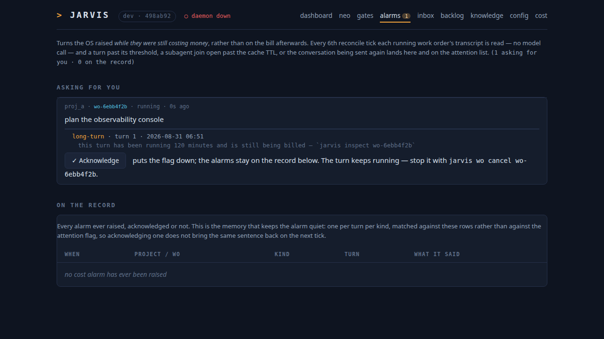
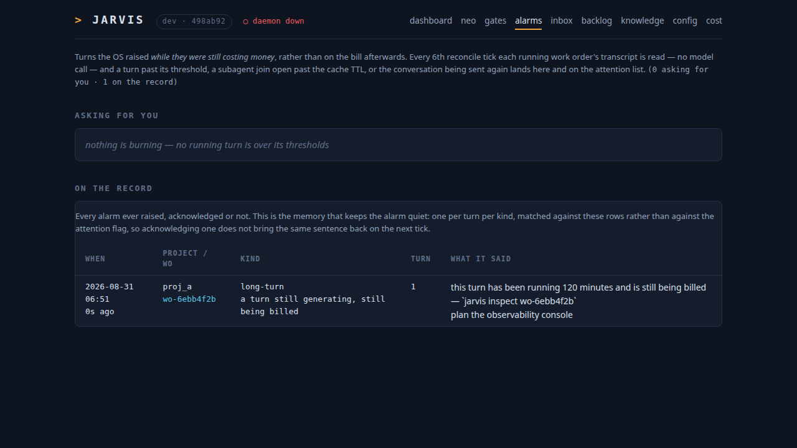

# The anatomy of a turn: where a session's TIME went

**Status:** shipped (wo-797367ee)
**Subject:** `jarvis inspect`, and the live alarm for a turn that is still burning
**Implements:** `docs/findings/anatomy-of-an-expensive-turn.md` — the METHOD this automates, with
the worked example it was derived from. That document is the specification; this one
records what building it changed, and §7 lists every departure from it.
**Companions:** `docs/superpowers/specs/2026-08-16-the-bill.md` (where the MONEY went),
kn-335170a1 (the cold-resume boundary), kn-f94abf34 (the cache-write TTL)

## 1. Why

`jarvis cost` reads the transcripts and reports tokens and dollars. It stops there.
Asked "how is a design-only agent taking 14-minute turns?", answering it took a
hand-written script over the raw JSONL — and the answer was three findings `jarvis cost`
cannot see, two of which are defects that cost money on every work order in the fleet.

The same file that carries the token counts carries a clock. This is the surface that
reads it.

## 2. The partition

The method's §1 step 4, with one bucket added:

| part | how it is measured |
|---|---|
| executing tools | `tool_use` timestamp to the matching `tool_result` timestamp |
| blocked | the subset of those spans whose tool is a BLOCKING JOIN (`TaskOutput`) |
| idle | after the turn's last API call, before the next turn's prompt |
| generating | the wall clock left over |

Blocked is carved OUT of tool time rather than counted beside it, because they are
opposite facts about the same seconds: 45 seconds of `Bash` is work being done, and 450
seconds of `TaskOutput` is the lead agent asleep with no API call in flight. What is left
after the three measured buckets is charged to the model, including the gaps between
spans; inside a running process there is nothing else it can be.

`Agent` is not a join. It returns as soon as the subagent is backgrounded; the wait it
defers is exactly what a later `TaskOutput` collects.

`idle` is the one addition, and §7.1 is why it exists.

### 2.1 Where a turn begins and ends

A turn begins at a prompt row and ends at the last thing the token accounting can see
inside it. Both halves of that sentence were bugs before they were rules.

**It begins at a prompt, but not at every prompt.** `Daemon.deliver_messages` coalesces
everything queued for a work order into one turn, so a `<task-notification>` and the Neo
answer twenty milliseconds behind it are two triggers of ONE turn. A new turn starts only
at a prompt with an assistant message since the last one started.

**Not only the injected ones.** The order specified `promptSource == "sdk"`, which is
right for where the REASON is quoted from and wrong for where a turn starts: a session
the user picked up by hand (`jarvis wo inject`, or a worker they resumed themselves) has
turns Jarvis never sent. Reading only the injected prompts fused one real session's last
two days into a single "turn". A `user` row is a prompt unless it is a tool result or
`isMeta` — the latter is Claude Code talking to itself, and counting one would cut a turn
in half at the moment a skill loaded.

**It has two ends, not one.** `ended` runs on to the next turn's prompt, which is the
method's own rule (§2) and is what makes the turns sum to the session with nothing
dropped. `active_ended` is the last thing the token accounting can COUNT inside it — its
own API calls and finished tool spans. The gap between them is `idle`.

Neither end can be taken from the row clock. A transcript can be appended to long after
its last call — an old-transport session resumed by hand under the same id writes
conversation rows with no prompt row before them — and one such file charged a 21-minute
turn with TWELVE DAYS. That case has no successor to run on to, so the LAST turn of a
session ends at `active_ended`; bounding it by what `usage` can count is also what keeps
`jarvis inspect` and `jarvis cost` cutting the session at identical points.

## 3. Three cache writes that look identical

A large `cache_creation_input_tokens` is the single most expensive event in a session and
nothing said WHY it happened. Three causes, three different fixes:

| label | test | fix |
|---|---|---|
| `cold-start` | the first call of the session | none — unavoidable |
| `ttl-expiry` | the previous call is older than the TTL it bought | wait less |
| `prefix-miss` | the previous call is RECENT and the prefix was re-written anyway | upstream (kn-335170a1) — a DEFECT |

The gap is measured against the TTL the PREVIOUS call bought, not against a constant.
Every Jarvis write before `FORCE_PROMPT_CACHING_5M` was a 1-hour write (kn-f94abf34), and
testing one of those against 300 seconds would report an honest expiry as a defect.

**The threshold is load-bearing.** Inside one turn every call after the first writes the
delta it just added while reading the rest — a few thousand tokens, seconds after the
previous call, which the gap test alone calls a `prefix-miss`. It is not one; it is the
cache working. Only a write large enough to be a re-send of the conversation is
classified at all, and every report states the floor it used.

### 3.1 The worked example, which is also the regression fixture

`wo-5a6b2d6d`, the planner of `fo-306b8f48`: a design-only agent, $19.28 / 19.0M tokens,
three ~14-minute turns. 1886s of wall clock: 64% generating, 31% blocked on a subagent
join, 3% executing tools, 2% idle between turns — and 64% + 2% is the method's 66%
(§7.1). 55 `Bash` calls averaging 0.8s — reading the whole codebase cost 45.6 seconds
against 9.6 minutes of waiting for two subagents.

    t = 0.00m    45,169 written,      0 read                    cold-start
    t = 14.49m  157,098 written, 15,862 read, 12.4s gap         prefix-miss
    t = 23.53m  193,139 written,      0 read,  450s gap         ttl-expiry

The middle one is the number that matters, and it is why the labels exist: fleet-wide the
re-write tax is ~24% of all spend and it is NOT primarily TTL expiry.

The session is committed as `tests/data/transcripts/`, reduced to its skeleton by
`scripts/redact_transcript.py` — the clock, the usage objects and the tool ids survive;
every payload is dropped. 1.5 MB of source code and other people's words became 166 KB of
arithmetic that reproduces all three findings exactly.

## 4. Two corrections to the method, found by implementing it

Both are recorded here because the method document is committed beside this one and a
reader will check the command's output against it.

**4.1 — §3.2's absolute total counts every API response up to three times.** It reports
1,797,566 cache-write tokens for the subject session. That is the sum over transcript
ROWS, and Claude Code writes a single assistant message once per content block as its
text grows; deduped by message id the lead agent wrote **569,173** (127 rows, 68
messages). This is the trap `usage._assistant_messages` was written for and which the
work order's constraints require reusing rather than re-deriving. **The finding is
unaffected**: 1h = 0 either way, because the duplicates inflate both sides of the ratio
equally, and a zero stays a zero.

**4.2 — §2's per-turn wall clock silently includes time when nothing was running.** See
§7.1.

## 5. Repairs this instrument found and did NOT make

Both belong to `wo-237d6dc4`, which is queued with the measurements. Building the
instrument added one thing to them:

**The prefix-miss is not rare and it is not the tail.** Across every dispatched work
order on this machine, the largest re-write per order has a MEDIAN of 130,519 tokens.
`ttl-expiry` and `prefix-miss` are of the same order of magnitude (medians 163,093 and
84,479) and together account for 67.3M cache-write tokens against 3.6M of honest cold
starts. Whatever fixes the prefix-miss is worth roughly what fixes the TTL expiry, and
neither is a rounding error.

## 6. The live half, and why its defaults are what they are

Every cost surface Jarvis had answered after the fact. The alarm runs the same arithmetic
against a turn that has not finished, on the reconcile cadence, and reaches the user
through the attention list rather than inventing a channel.

A NOISY COST ALARM GETS IGNORED, and then it is worse than nothing. So each threshold was
set from the fleet's own history — 438 worker turns across 118 dispatched work orders —
at a point where it fires on a small minority:

| setting | default | why |
|---|---|---|
| `alarm_turn_minutes` | 60 | p95 of a turn's ACTIVE time is 59 minutes; fires on 16% of orders, and sits well below the 6-hour `is_stalled` flag, which is a different fact (hung, not expensive) |
| `alarm_join_seconds` | 300 | the 5-minute cache TTL itself: past it the prefix is cold, so the wait converts into a re-write. Fires on 2% |
| `alarm_write_tokens` | 300,000 | p95 of the largest re-write per order (median 130,519). ~$1.88 at Opus list in one event. Fires on 5% |

`alarm_join_seconds` is the only one that is principled rather than empirical, and it is the
one that would have caught the 450-second block in §3.1.

### 6.1 The sequence, end to end

`jarvis inspect` is a read a person asks for. The alarm is the only part of this work
that changes the daemon's execution flow, so here is exactly what runs, when, and what it
touches.

**Where it is called from.** `Daemon.tick()` runs every poll interval. Every
`RECONCILE_EVERY_TICKS` (6) ticks it additionally runs the reconcile block, and
`check_burning_turns` is the second-to-last step of it — after `seal_bills`, before
`check_invariants`. It runs on the reconcile cadence and not every tick because it reads
a file per running work order; it runs before the invariants because it is a fact about
work still RUNNING, not about state that has settled.

```
Daemon.tick()                                    every poll interval
└── if tick_count % RECONCILE_EVERY_TICKS == 1:  every 6th tick
    ├── track_injected_sessions()
    ├── seal_bills()
    ├── check_burning_turns(project, store)      ◄── THE ALARM
    └── check_invariants()
```

```
check_burning_turns(project, store)
│
├─ project.inspect.enabled is False? ──────────────────────────► return, nothing read
│
├─ usage.index_sessions()            one directory walk, shared by every work order below
│
└─ for each work order with status == "running":
   │
   ├─ no session_id, or origin is ungoverned? ─────────────────► skip
   │     (an injected session is the user's own; they are watching it)
   ├─ store.latest_turn() is None or not "running"? ───────────► skip
   │
   ├─ inspection.live_alarms(session_id, project.inspect, now=time.time())
   │  │
   │  ├─ read_session()   ONE transcript read. No model call, nothing written.
   │  │                   Read at alarm_write_tokens, not report_write_floor: the small
   │  │                   writes would be classified and then thrown away.
   │  └─ alarms()         judges THE LAST TURN ONLY, against three thresholds:
   │        • wall = max(turn.wall, now - turn.started)  ≥ alarm_turn_minutes × 60
   │             └─► "long-turn"    a turn still being billed
   │        • an UNFINISHED join open ≥ alarm_join_seconds
   │             └─► "long-join"    past the cache TTL, so the wait is paid for twice
   │        • a write in this turn ≥ alarm_write_tokens and not cold-start
   │             └─► "big-rewrite"  the conversation is being paid for again
   │
   ├─ store.events_of_kind(wo_id, "cost_alarm")
   │     └─ drop any alarm whose (kind, turn seq) is already on the timeline
   │
   ├─ for each REMAINING alarm: store.add_event("cost_alarm", {kind, seq, reason})
   │                            log.info(...)
   │
   └─ if any remained AND the work order is not already flagged:
         store.flag_attention(wo_id, first_alarm.reason)
```

**What the user sees.** Exactly what every other blocker looks like — no new channel:

```
$ jarvis status
  attention
    wo-1a2b3c4d  jarvis_os  this turn has been running 74 minutes and is still
                            being billed — `jarvis inspect wo-1a2b3c4d`
```

and on the work order's timeline, one row per alarm:

```
$ jarvis wo show wo-1a2b3c4d
  ...
  Costing money while it runs   this turn has been running 74 minutes …
  Needs you                     this turn has been running 74 minutes …
```

**What it does NOT do.** It never cancels a turn, never sends the worker a message, never
calls a model and never writes anything but the timeline event and the attention flag.
The turn keeps running; the decision to let it or stop it is the user's, and
`jarvis wo cancel` is the same command it always was. `worker_session.is_stalled` (6h) is
untouched and still reports the different fact — hung rather than expensive.

**Why the timeline event and not the attention flag is the memory.** The flag alone
cannot be the record: `jarvis wo ack` puts it down, and on the next reconcile tick the
same condition is still true, so the same sentence would come straight back. Matching on
`(kind, turn seq)` in the timeline is what makes it ONE alarm per turn per kind, and it
is why acknowledging one actually ends it. A new turn is a new seq and can raise its own.

**Cost of running it.** One `index_sessions()` directory walk plus one transcript read per
RUNNING work order, every 6th tick. Nothing when the fleet is idle, because a project with
no running work order reads no files at all.


### 6.2 Reviewing them: `jarvis alarms` and `/alarms`

Raising an alarm and REVIEWING alarms are opposite reads, and the timeline could only do
the first. `jarvis wo show` puts one alarm on one work order's timeline; the question "what
has the fleet been burning, and what still wants me?" would have meant opening every work
order there is. `ProjectStore.events_across` is the read that answers it — every event of
one kind in a project, newest first, with its work order joined on, because an alarm is
about a title and a status and is unreadable as a bare id.

Both surfaces render the same `ops.list_cost_alarms`, split the same way:

- **Asking for you** — grouped BY WORK ORDER, not by alarm. The attention flag carries one
  sentence, so three alarms on one order were only ever one ask; three buttons that all do
  the same thing would be a lie about how many decisions the user has.
- **On the record** — every alarm ever raised, acknowledged or not. This half is meant to
  be long and is meant to sit there unacted on: it is the memory that keeps the alarm
  quiet (§6.1), so a page that hid it would hide the reason acking works.

Acking from the list returns the user to the list (`back=alarms`), because they are
working through a queue rather than visiting an order. The value is checked against a
known path rather than used as a redirect target.





`jarvis alarms [project]` is the same read in the terminal. Not a convenience: the CLI is
the OS (prime directive 1), and a dashboard page that is the only way to see something the
OS knows would be the first exception to that.


### 6.3 Every threshold is a setting, fleet-wide and per project

NOTHING IN `inspection.py` HARD-CODES A THRESHOLD. `catalog.InspectConfig` holds all six,
and `tests/test_inspection.py::test_nothing_in_the_module_hard_codes_a_threshold` walks
the module's AST and fails on any numeric literal outside a short allow-list of loop
indices and the two cache TTLs — so a later change that reaches for a literal is caught
here rather than in review.

| setting | default | what it decides |
|---|---|---|
| `report_write_floor` | 20,000 | which cache writes `jarvis inspect` classifies. The method's own figure (§1 step 5) |
| `report_join_floor` | 30 | which blocking joins get a line |
| `quote_chars` | 140 | how much of a triggering prompt is quoted |
| `alarm_turn_minutes` | 60 | when a running turn interrupts the user |
| `alarm_join_seconds` | 300 | when an open join does |
| `alarm_write_tokens` | 300,000 | when a single re-write does |

The `report_` pair and the `alarm_` trio are prefixed rather than nested so that a reader
of `jarvis config show` cannot mistake one for the other: they are thresholds on the same
quantities at very different bars (30s against 300s for a join; 20k against 300k for a
write), and swapping them would either flood the attention list or empty the report.

Reachable as `os.inspect.*` and as `projects[].inspect.*`, with FIELD-LEVEL INHERITANCE
(`catalog._parse_inspect`, modelled on `_parse_validation` — kn-6ca2bcd9): a project
naming one key keeps the OS answer for the other five, and `ProjectSpec.inspect` is fully
resolved so no caller consults two objects. `config_version.resolve` walks the dataclasses
reflectively, so `jarvis config set proj_a inspect.alarm_turn_minutes 20` works with no
edit to the config console.

Per project rather than only fleet-wide because a threshold is a claim about what is
NORMAL, and normal differs by project: an hour-long turn is routine where the work is a
design document and a symptom where it is a one-file fix.

A value below 1 is refused at parse time rather than clamped — zero would report every
write a session makes and flag every work order the fleet runs, and it arrives by a typo.

`TTL_5M` and `TTL_1H` stay constants and are the only numbers here that are not settings:
they are the two durations Anthropic's cache actually offers (kn-f94abf34), not a policy
Jarvis holds an opinion about. A catalog that could declare the cache lives for an hour
when it does not would make every `ttl-expiry` label downstream wrong.

**One alarm per turn per kind**, recorded as a `cost_alarm` timeline event and checked
against that record rather than against the attention flag. The flag is not enough: the
user putting it down with `jarvis wo ack` would bring the same sentence straight back on
the next tick, which is exactly how a cost alarm becomes noise.

**Only the last turn is judged.** An alarm about spend the user can no longer prevent is
the noise; everything earlier belongs on `jarvis inspect`. It is measured against the
turn's ACTIVE time — a running turn has no successor, so it has no `idle` yet.

## 7. Every departure from the method

### 7.1 `idle` is split out of `generating`

The method charges everything outside a tool span to the model. On its subject session
that is right to within 46 seconds: the gap between a turn's last API call and the next
turn's prompt is 5s and 41s, which is Jarvis's own delivery latency and invisible at this
scale. Across the fleet's 441 worker turns the same gap reaches **eleven days**, on a turn
that HAS a successor — a work order parked in `waiting_input` until a `wo send` arrived.
Charging that to "model generating" would make the headline of every parked work order a
lie.

So it is reported as its own bucket, and `generating + idle` recovers the method's figure
exactly: 1205s + 46s = **1252s = 66%**, which is what §-summary asserts. Nothing is lost
and the parked case reads correctly.

### 7.2 A `user` prompt is a turn boundary too

The method reads turn boundaries from `promptSource == "sdk"` (§1 step 3). That is right
for where a turn's REASON is quoted from and wrong for where one starts: a session the
user injected (`jarvis wo inject`) or a worker they resumed by hand has turns Jarvis never
sent, and reading only the injected ones fused one real session's last two days into a
single turn. A `user` row starts a turn unless it is a tool result or `isMeta` — the
latter is Claude Code talking to itself, and counting one would cut a turn in half at the
moment a skill loaded.

### 7.3 A third write label: `cold-start`

§4 requirement 3 names two labels, `TTL-expiry` and `prefix-miss`. The first write of a
session is neither — §3.5 discusses it separately and it is not a defect — so it gets its
own label rather than being mislabelled a prefix-miss for having no predecessor.

## 8. What it costs to run

Nothing paid. One transcript read per running work order per reconcile tick, over files
Claude Code already wrote. Read-only, nothing persisted except the timeline event, and a
transcript that has expired reports `found: false` the way `jarvis cost` already does —
an unmeasurable clock and an idle one are different answers.
